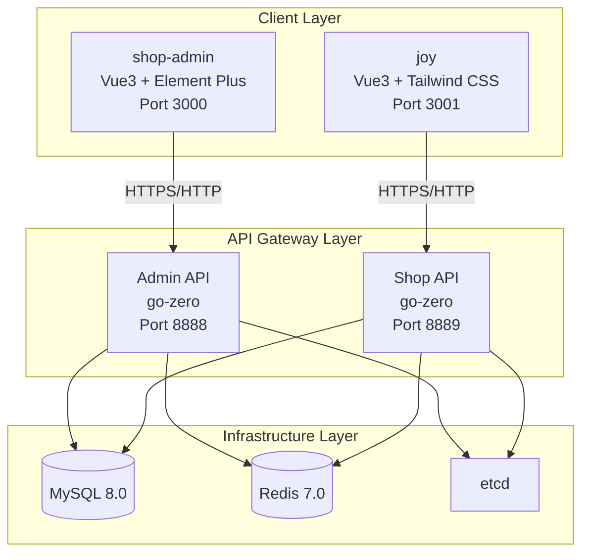
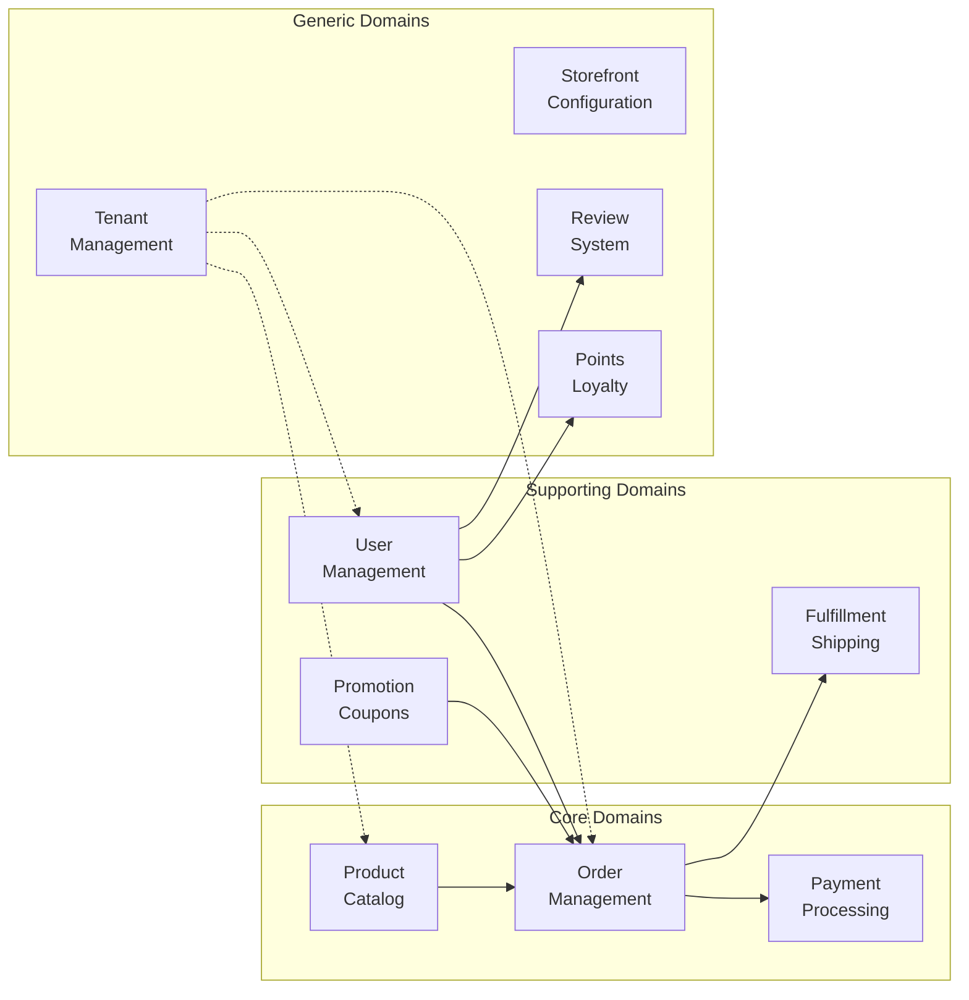
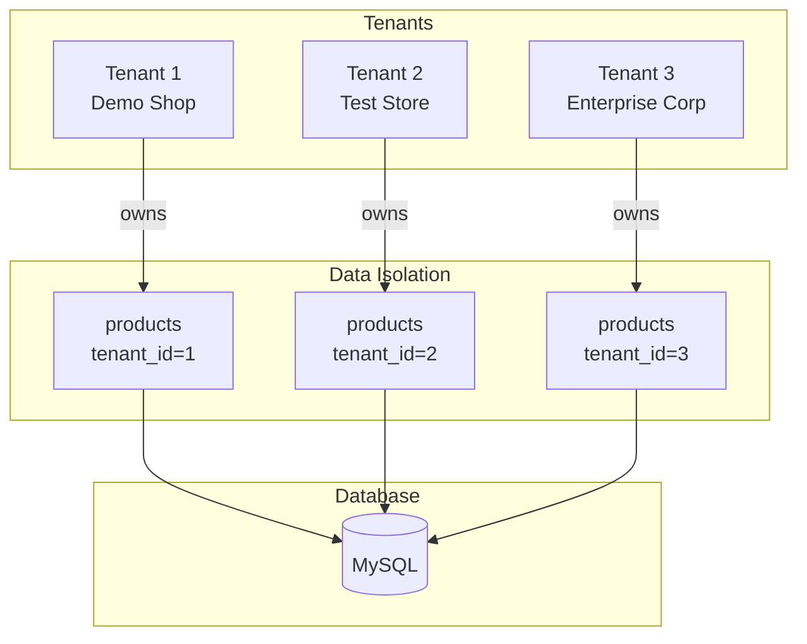
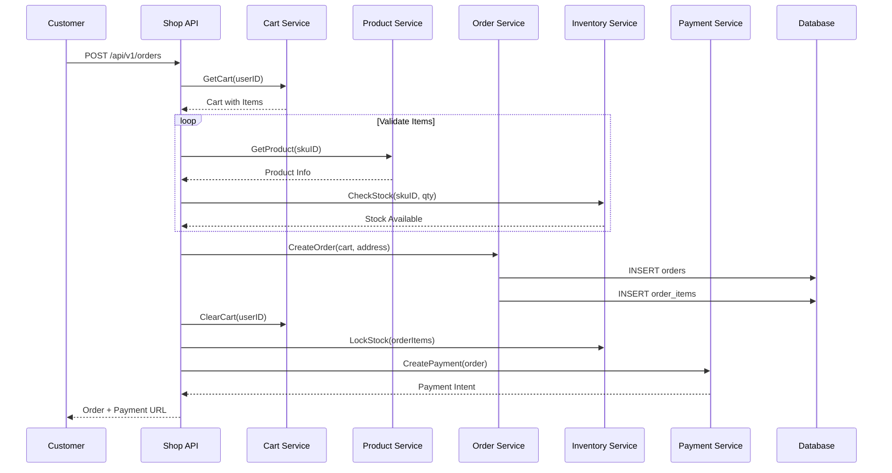
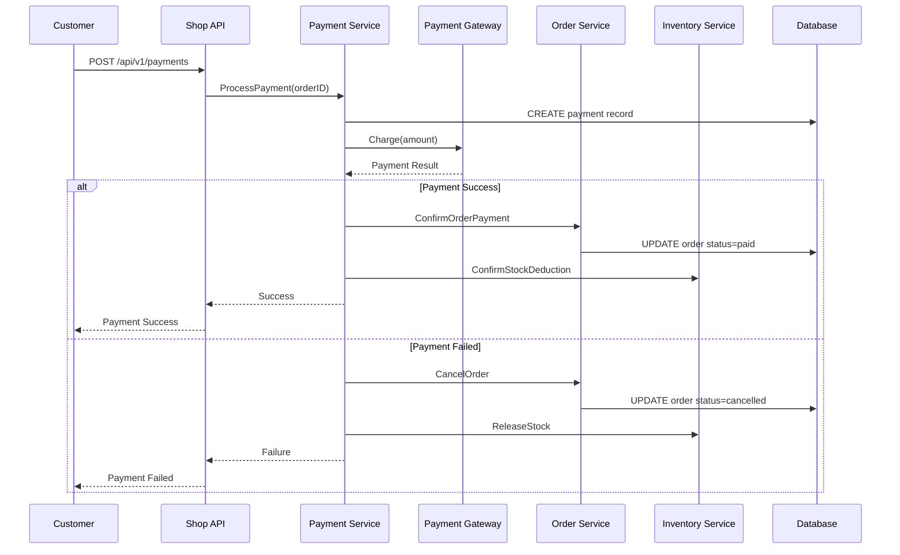
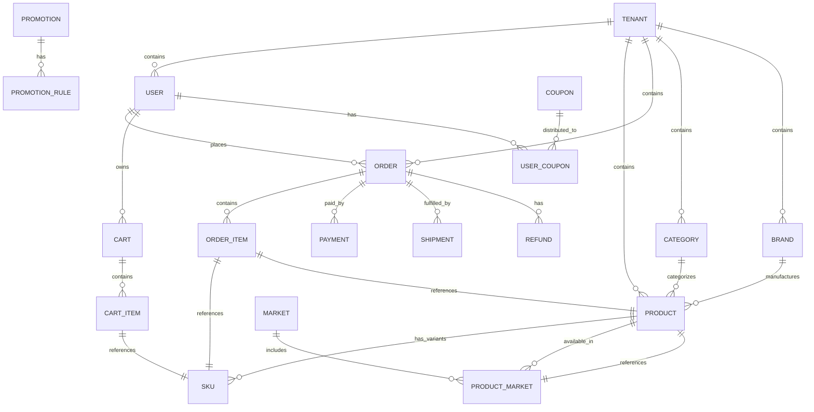
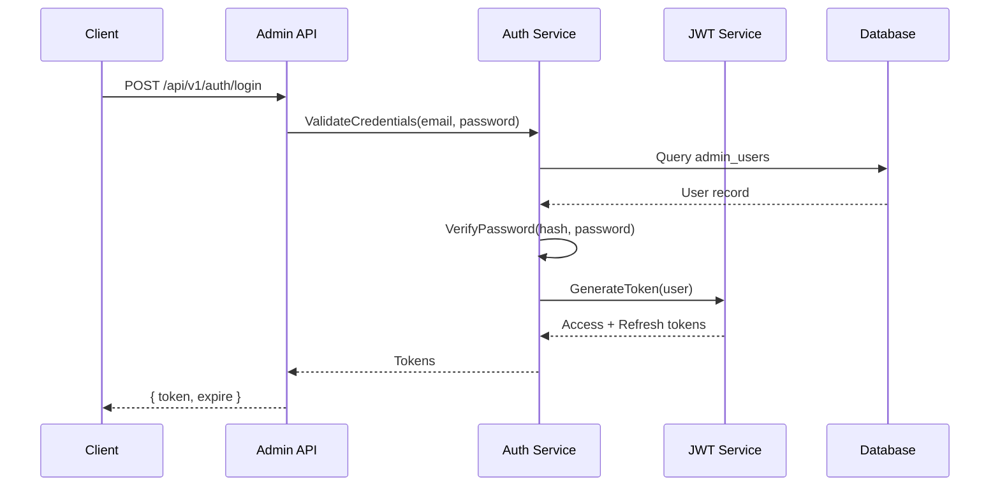
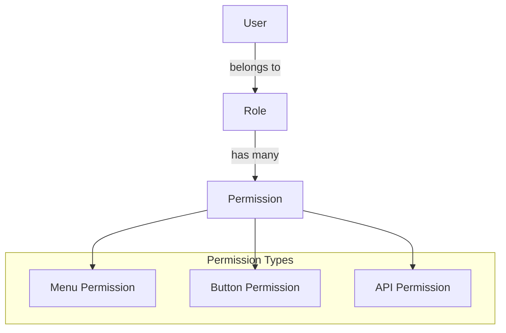
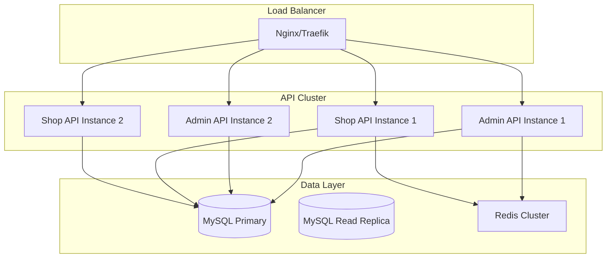

# ShopJoy Architecture Documentation

> **Version:** 1.0
> **Last Updated:** 2026-03-26
> **Status:** Active Development

---

## Executive Summary

ShopJoy is a **multi-tenant e-commerce SaaS platform** built with Go (go-zero framework) and Vue.js. It implements **Domain-Driven Design (DDD)** principles with clear separation of concerns across 10 business domains. The platform supports multiple tenants (merchants) with complete data isolation while sharing infrastructure resources.

### Key Characteristics

| Aspect | Description |
|--------|-------------|
| **Architecture Style** | Microservices-inspired modular monolith |
| **Design Pattern** | Domain-Driven Design (DDD) with Layered Architecture |
| **Multi-Tenancy** | Shared database, tenant-isolated data (tenant_id) |
| **API Style** | RESTful with JWT authentication |
| **Frontend** | Vue 3 + TypeScript + Vite |

---

## System Architecture Overview

### Service Architecture



### Service Responsibilities

| Service | Port | Purpose | Target Users |
|---------|------|---------|--------------|
| **admin** | 8888 | Management backend APIs | Store administrators, operators |
| **shop** | 8889 | Customer-facing storefront APIs | End customers |
| **shop-admin** | 3000 | Admin dashboard UI | Store administrators |
| **joy** | 3001 | Storefront frontend | End customers |

---

## Domain-Driven Design Structure

### 10 Business Domains



### Domain Mapping

| Domain | Backend Location | Database Schema | Documentation |
|--------|-----------------|-----------------|---------------|
| **user** | `admin/internal/domain/{user,adminuser,role,tenant}/` | `sql/user/schema.sql` | `docs/domains/user/` |
| **product** | `admin/internal/domain/{product,market}/` | `sql/product/schema.sql` | `docs/domains/product/` |
| **order** | `shop/internal/domain/order/`, `shop/internal/domain/cart/` | `sql/order/schema.sql` | `docs/domains/order/` |
| **promotion** | `admin/internal/domain/{promotion,coupon}/` | `sql/promotion/schema.sql` | `docs/domains/promotion/` |
| **payment** | `shop/internal/domain/payment/`, `admin/internal/domain/payment/` | `sql/payment/schema.sql` | `docs/domains/payment/` |
| **fulfillment** | `admin/internal/domain/fulfillment/` | `sql/fulfillment/schema.sql` | `docs/domains/fulfillment/` |
| **storefront** | `admin/internal/domain/storefront/` | `sql/storefront/schema.sql` | `docs/domains/storefront/` |
| **shop** | `admin/internal/handler/shop/` | `sql/shop/schema.sql` | `docs/domains/shop/` |
| **review** | `admin/internal/domain/review/` | `sql/review/schema.sql` | `docs/domains/review/` |
| **points** | `admin/internal/domain/points/` | `sql/points/schema.sql` | `docs/domains/points/` |

---

## Layered Architecture

### DDD Layer Structure

```
┌─────────────────────────────────────────────────────────────┐
│                    Interface Layer                          │
│  ┌─────────────┐  ┌─────────────┐  ┌─────────────────────┐  │
│  │   Handler   │  │ Middleware  │  │   API Definition    │  │
│  │  (go-zero)  │  │(Auth, Tenant)│  │     (*.api)         │  │
│  └─────────────┘  └─────────────┘  └─────────────────────┘  │
├─────────────────────────────────────────────────────────────┤
│                  Application Layer                          │
│  ┌─────────────┐  ┌─────────────┐  ┌─────────────────────┐  │
│  │   Service   │  │     DTO     │  │   Use Case Logic    │  │
│  │  (Logic)    │  │ (Request/   │  │   (Orchestration)   │  │
│  │             │  │  Response)  │  │                     │  │
│  └─────────────┘  └─────────────┘  └─────────────────────┘  │
├─────────────────────────────────────────────────────────────┤
│                     Domain Layer                            │
│  ┌─────────────┐  ┌─────────────┐  ┌─────────────────────┐  │
│  │   Entity    │  │Value Object │  │ Repository Interface│  │
│  │ (Aggregate  │  │  (Money,    │  │    (Domain Logic)   │  │
│  │   Root)     │  │  TenantID)  │  │                     │  │
│  └─────────────┘  └─────────────┘  └─────────────────────┘  │
├─────────────────────────────────────────────────────────────┤
│               Infrastructure Layer                          │
│  ┌─────────────┐  ┌─────────────┐  ┌─────────────────────┐  │
│  │Repository   │  │   External  │  │   Message Queue     │  │
│  │Implementation│  │   Services  │  │      (asynq)        │  │
│  │   (GORM)    │  │             │  │                     │  │
│  └─────────────┘  └─────────────┘  └─────────────────────┘  │
└─────────────────────────────────────────────────────────────┘
```

### Layer Responsibilities

#### 1. Interface Layer
- **Location**: `admin/internal/handler/`, `shop/internal/handler/`
- **Purpose**: Handle HTTP requests/responses
- **Key Components**:
  - API handlers (auto-generated from .api files)
  - Middleware (authentication, tenant context)
  - Request validation

#### 2. Application Layer
- **Location**: `admin/internal/application/`, `shop/internal/application/`
- **Purpose**: Orchestrate use cases, coordinate domain objects
- **Key Components**:
  - Application services
  - DTOs (Data Transfer Objects)
  - Transaction management

#### 3. Domain Layer
- **Location**: `admin/internal/domain/`, `shop/internal/domain/`, `pkg/domain/`
- **Purpose**: Core business logic, business rules
- **Key Components**:
  - Entities (aggregate roots)
  - Value objects (Money, TenantID)
  - Repository interfaces
  - Domain events

#### 4. Infrastructure Layer
- **Location**: `admin/internal/infrastructure/`, `pkg/infra/`
- **Purpose**: Technical capabilities, external integrations
- **Key Components**:
  - Repository implementations (GORM)
  - Database connections
  - Redis clients
  - Message queue (asynq)

---

## Multi-Tenant Architecture

### Tenant Isolation Strategy

ShopJoy uses **Shared Database with Tenant ID Discriminator** pattern:



### Tenant Context Propagation

```go
// From pkg/tenant/tenant.go
type TenantContext struct {
    TenantID   shared.TenantID
    TenantCode string
    UserID     int64
    UserType   int // 1=super_admin, 2=tenant_admin, 3=sub_account
}

// Middleware injects tenant context from JWT
func TenantMiddleware(next http.HandlerFunc) http.HandlerFunc {
    return func(w http.ResponseWriter, r *http.Request) {
        // Extract tenant_id from JWT claims
        // Inject into context for downstream use
    }
}
```

### Tenant-Aware Queries

All queries include `tenant_id` filter:

```go
// Repository pattern with tenant isolation
func (r *ProductRepository) FindByID(ctx context.Context, db *gorm.DB,
    tenantID shared.TenantID, id int64) (*product.Product, error) {
    var p product.Product
    err := db.WithContext(ctx).
        Where("id = ? AND tenant_id = ?", id, tenantID.Int64()).
        First(&p).Error
    return &p, err
}
```

---

## Data Flow Architecture

### Order Creation Flow



### Payment Processing Flow



---

## Shared Kernel

### Common Value Objects

Located in `pkg/domain/shared/`:

#### Money
```go
type Money struct {
    Amount   int64  // Stored in cents (smallest currency unit)
    Currency string // ISO 4217 code: CNY, USD, EUR
}

// Methods: Add(), Subtract(), Multiply(), Equals(), IsZero()
```

#### TenantID
```go
type TenantID int64

func (t TenantID) Int64() int64
func (t TenantID) String() string
func (t TenantID) IsValid() bool
```

#### AuditInfo
```go
type AuditInfo struct {
    CreatedAt time.Time
    UpdatedAt time.Time
    CreatedBy int64
    UpdatedBy int64
}
```

#### UnixTime
```go
// Wrapper for time.Time that stores as Unix timestamp in database
type UnixTime struct {
    time.Time
}

// Implements sql.Scanner and driver.Valuer for BIGINT storage
```

---

## Entity Relationship Overview

### Core Entity Relationships



---

## Technology Stack

### Backend Technologies

| Technology | Version | Purpose |
|------------|---------|---------|
| **Go** | 1.24 | Primary language |
| **go-zero** | v1.10.0 | Microservices framework |
| **GORM** | v1.31.1 | ORM for database operations |
| **MySQL** | 8.0 | Primary database |
| **Redis** | 7.0 | Caching, sessions, distributed locks |
| **etcd** | v3.6.8 | Service discovery, configuration |
| **asynq** | v0.26.0 | Async task queue |
| **JWT** | v4.5.2 | Authentication |
| **sonic** | v1.15.0 | High-performance JSON |
| **decimal** | v1.4.0 | Precise decimal arithmetic |
| **OpenTelemetry** | v1.34.0 | Observability |

### Frontend Technologies

| Technology | Version | Purpose |
|------------|---------|---------|
| **Vue.js** | 3.4+ | Frontend framework |
| **TypeScript** | 5.x | Type safety |
| **Vite** | 5.x | Build tool |
| **Element Plus** | 2.x | UI component library (admin) |
| **Tailwind CSS** | 3.x | Utility-first CSS (joy) |
| **Pinia** | 2.x | State management |
| **Vue Router** | 4.x | Routing |
| **ECharts** | 5.x | Data visualization |

---

## Security Architecture

### Authentication Flow



### JWT Token Structure

```go
// Token claims include:
type CustomClaims struct {
    UserID     int64  `json:"user_id"`
    TenantID   int64  `json:"tenant_id"`
    UserType   int    `json:"user_type"`   // 1=super, 2=tenant_admin, 3=sub
    Permission string `json:"permission"`  // Role-based permissions
}
```

### RBAC Permission Model



---

## Scalability Considerations

### Horizontal Scaling

| Component | Scaling Strategy |
|-----------|-----------------|
| **API Services** | Stateless, can run multiple instances behind load balancer |
| **MySQL** | Read replicas for query scaling; sharding for tenant isolation |
| **Redis** | Redis Cluster for cache and session distribution |
| **File Storage** | CDN for static assets; object storage (S3/MinIO) for uploads |

### Performance Optimizations

1. **Caching Strategy**
   - Redis for session storage
   - Product catalog caching
   - Hot data memoization

2. **Database Optimization**
   - Proper indexing on tenant_id for all queries
   - Query result pagination
   - Connection pooling

3. **Async Processing**
   - Order timeout handling via asynq
   - Inventory reconciliation
   - Report generation

---

## Deployment Architecture

### Docker Compose Setup

```yaml
# Services defined in docker-compose.yml
services:
  mysql:      # Database
  redis:      # Cache & Queue
  admin:      # Admin API service
  shop:       # Shop API service
  shop-admin: # Admin UI
  joy:        # Storefront UI
```

### Production Deployment



---

## Monitoring & Observability

### Metrics & Logging

| Tool | Purpose |
|------|---------|
| **Prometheus** | Metrics collection |
| **Grafana** | Visualization dashboards |
| **OpenTelemetry** | Distributed tracing |
| **Zap** | Structured logging |
| **Pyroscope** | Continuous profiling |

### Key Metrics

- API response times and error rates
- Database query performance
- Cache hit rates
- Queue depths and processing times
- Business metrics (orders/min, revenue)

---

## API Design Principles

### RESTful API Standards

1. **Resource Naming**: Plural nouns (`/products`, `/orders`)
2. **HTTP Methods**:
   - `GET` - Read
   - `POST` - Create
   - `PUT` - Update (full)
   - `PATCH` - Update (partial)
   - `DELETE` - Remove
3. **Status Codes**: Standard HTTP status codes
4. **Pagination**: Standard page/page_size pattern
5. **Filtering**: Query parameters for list endpoints

### API Versioning

Current version: **v1**

All endpoints prefixed with `/api/v1/`

### Error Response Format

```json
{
  "code": 30012,
  "message": "product not found"
}
```

See [Error Codes Reference](../reference/error-codes.md) for complete list.

---

## Development Guidelines

### Code Organization

```
# Three-way correspondence principle
# Document, SQL, and Code organized by same domain

| Domain | Document | SQL | Code |
|--------|----------|-----|------|
| user   | docs/domains/user/ | sql/user/ | domain/{user,adminuser,role,tenant}/ |
```

### Build Commands

```bash
# Generate API code from .api files
cd admin && make api
cd shop && make api

# Build services
make build

# Run tests
go test ./...
```

### Code Generation

Handlers and types are auto-generated from `.api` files using go-zero's `goctl` tool.

---

## References

- [Developer Guide](../guides/developer-guide.md)
- [API Reference](../cross-cutting/api/api-reference.md)
- [Database Overview](../reference/database-overview.md)
- [Error Codes](../reference/error-codes.md)
- [Domain Documentation](../domains/)

---

## Document History

| Version | Date | Author | Changes |
|---------|------|--------|---------|
| 1.0 | 2026-03-26 | Technical Team | Initial comprehensive architecture documentation |
