# Architecture Diagrams

> Visual documentation of the ShopJoy system architecture

## System Overview

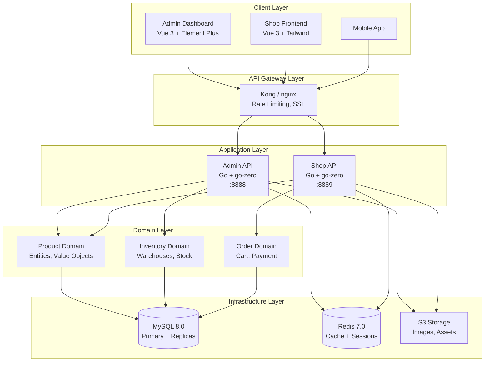

---

## DDD Layered Architecture

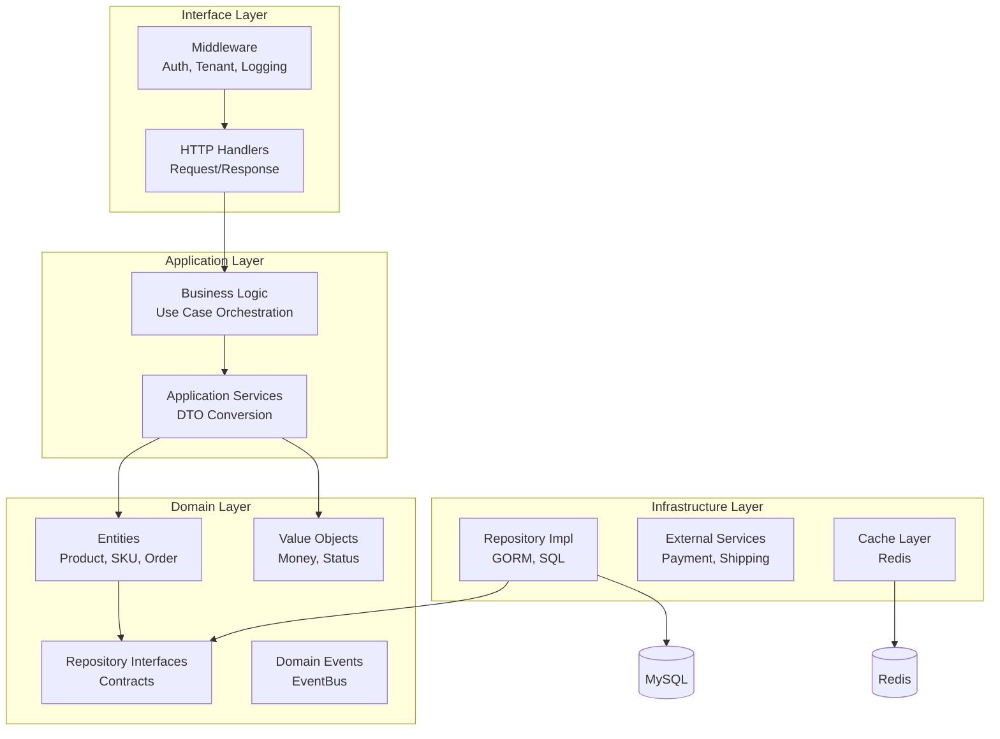

---

## Multi-Tenant Architecture

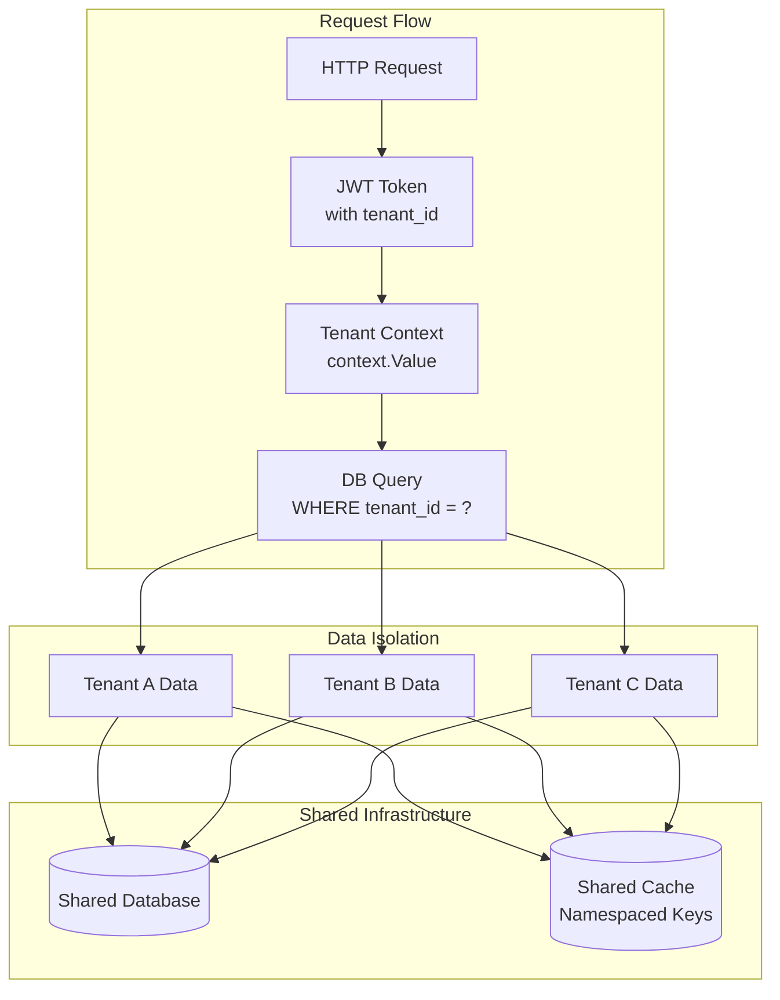

### Tenant Context Flow

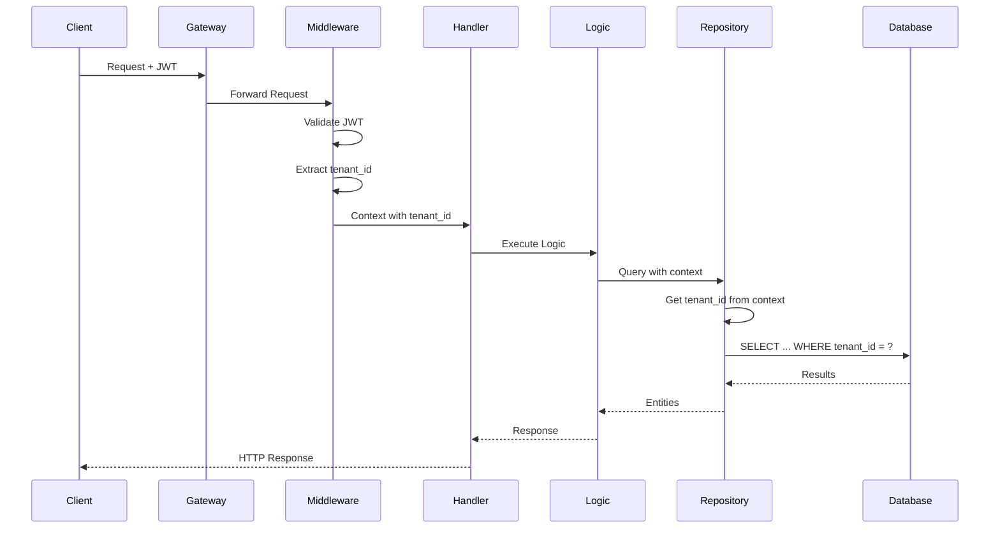

---

## Product Domain Model

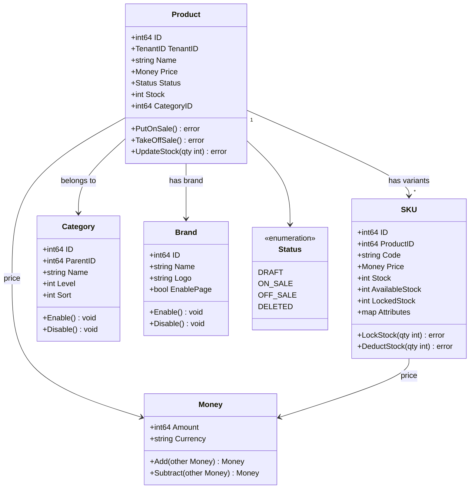

---

## Product Status State Machine

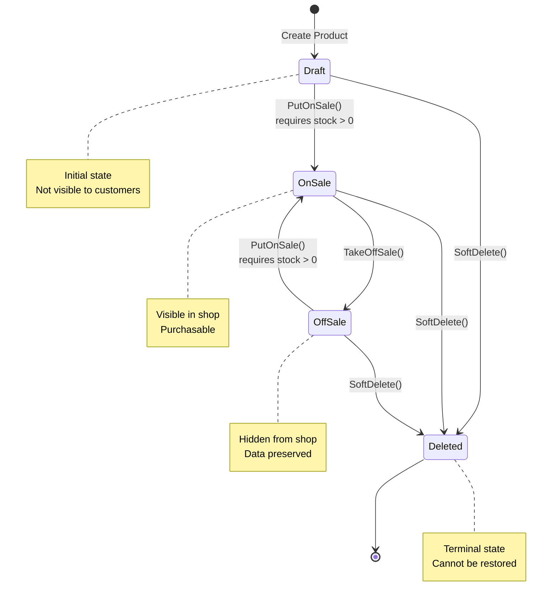

---

## Inventory Domain Model

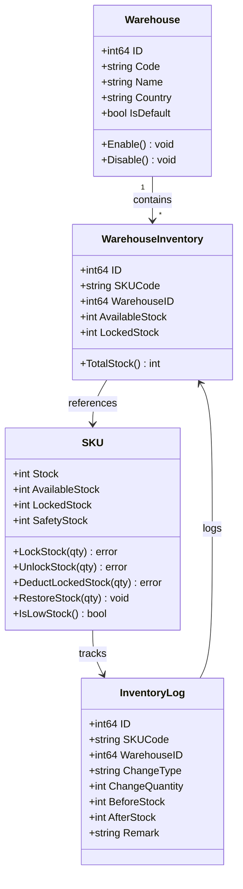

---

## Stock Management Flow

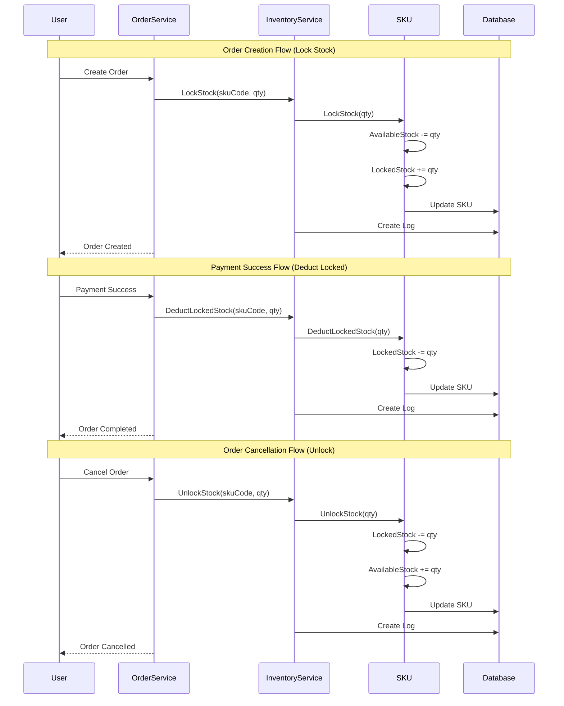

---

## Category Hierarchy

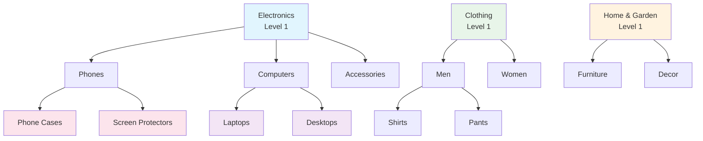

---

## Multi-Market Architecture

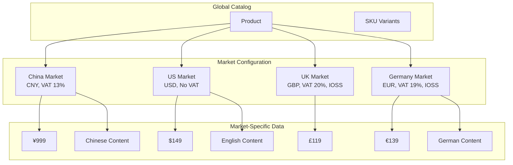

---

## API Request Flow

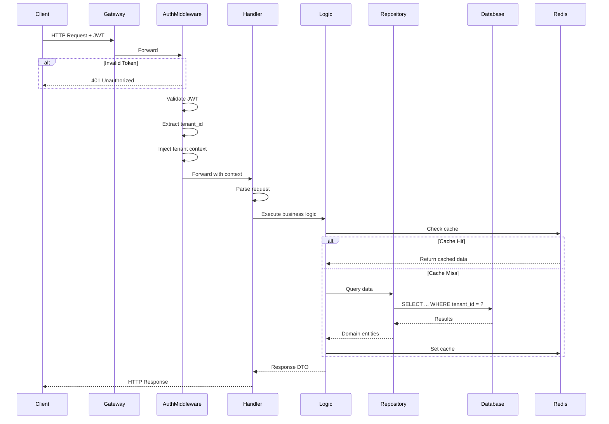

---

## Deployment Architecture

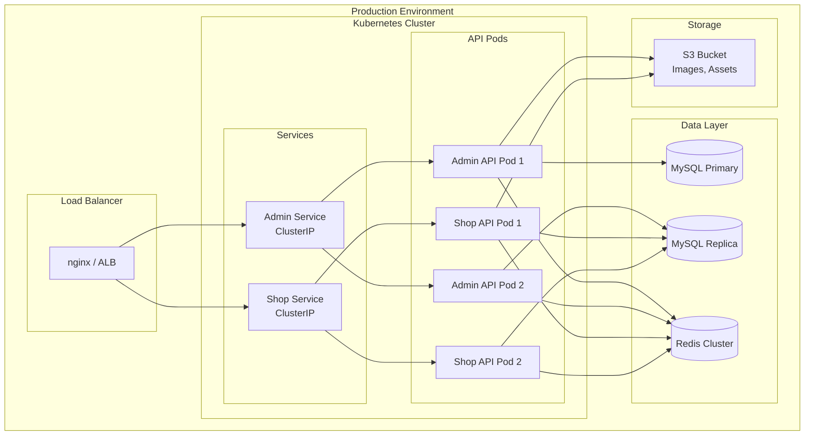

---

## Error Handling Flow

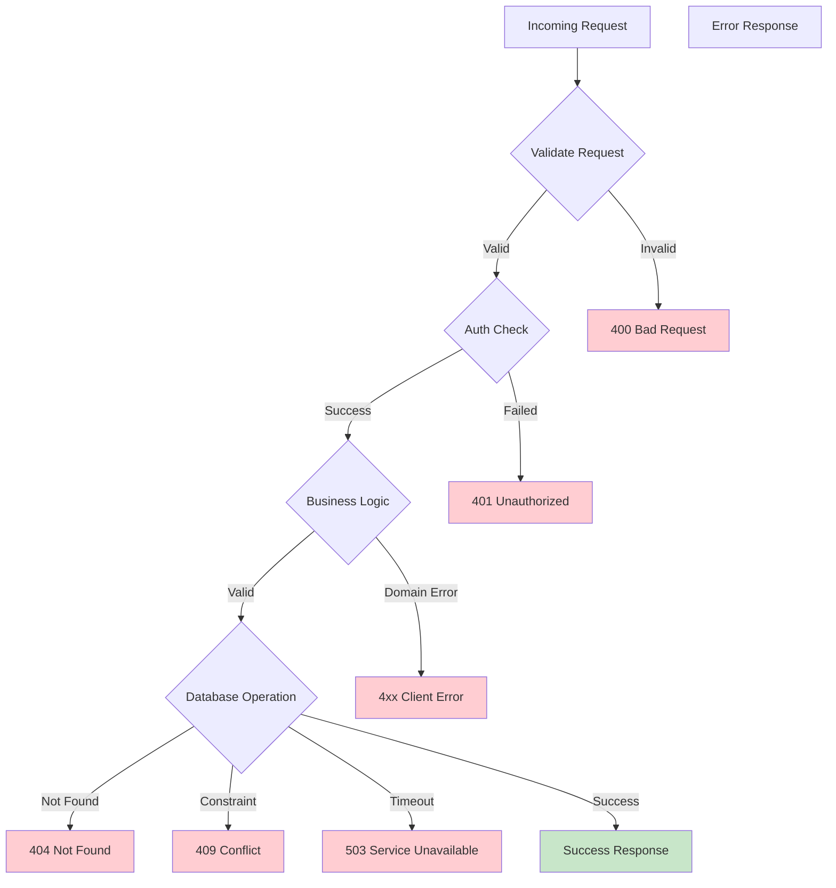

---

## Caching Strategy

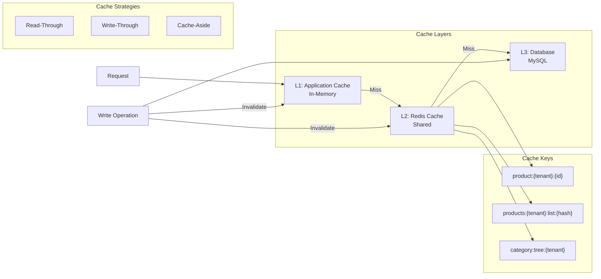

---

## Database Schema Overview

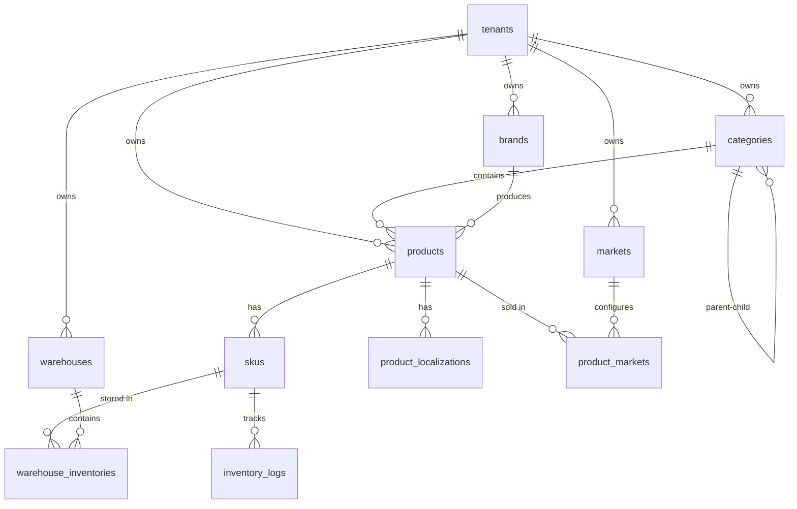

---

## Legend

| Symbol | Meaning |
|--------|---------|
| `()` | Database / External Service |
| `[]` | Application / Service |
| `-->` | Data Flow |
| `-->>` | Response |
| `<>` | Alternative Path |
| `()` in sequence | Participant |