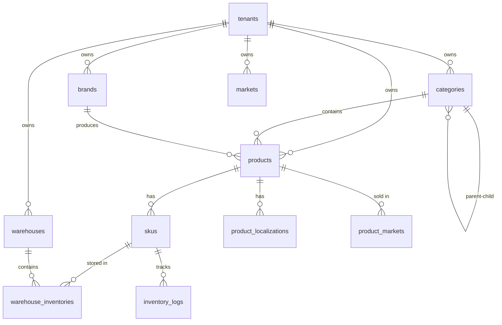

# Database Schema Documentation

> ShopJoy E-commerce Platform Database Design

## Overview

ShopJoy uses MySQL 8.0 as the primary database. The schema follows these principles:

- **Multi-tenancy**: All tables include `tenant_id` for data isolation
- **Soft delete**: Core tables use `deleted_at` for data recovery
- **Audit trail**: `created_at`, `updated_at`, `created_by`, `updated_by` on all tables
- **Unix timestamps**: Time stored as BIGINT Unix timestamps for consistency
- **Monetary values**: Prices stored as BIGINT in cents to avoid floating-point precision issues

---

## Entity Relationship Diagram



---

## Core Tables

### tenants

Multi-tenant configuration table.

| Column | Type | Nullable | Default | Description |
|--------|------|----------|---------|-------------|
| id | BIGINT | NO | AUTO_INCREMENT | Primary key |
| name | VARCHAR(100) | NO | - | Tenant name |
| slug | VARCHAR(100) | NO | - | URL-friendly identifier |
| plan | VARCHAR(20) | NO | 'free' | Subscription plan |
| status | TINYINT | NO | 1 | 0=inactive, 1=active |
| config | JSON | YES | NULL | Tenant configuration |
| created_at | BIGINT | NO | 0 | Creation timestamp |
| updated_at | BIGINT | NO | 0 | Update timestamp |
| deleted_at | BIGINT | YES | NULL | Soft delete timestamp |

**Indexes:**
- PRIMARY KEY (`id`)
- UNIQUE KEY `uk_slug` (`slug`)
- KEY `idx_status` (`status`)

---

### categories

Product category hierarchy (tree structure).

| Column | Type | Nullable | Default | Description |
|--------|------|----------|---------|-------------|
| id | BIGINT | NO | AUTO_INCREMENT | Primary key |
| tenant_id | BIGINT | NO | - | Tenant ID |
| parent_id | BIGINT | NO | 0 | Parent category (0 = root) |
| name | VARCHAR(100) | NO | - | Category name |
| code | VARCHAR(100) | NO | '' | Category code |
| level | TINYINT | NO | 1 | Tree level (1, 2, 3) |
| sort | INT | NO | 0 | Sort order |
| icon | VARCHAR(255) | NO | '' | Icon URL |
| image | VARCHAR(500) | NO | '' | Image URL |
| seo_title | VARCHAR(200) | NO | '' | SEO title |
| seo_description | VARCHAR(500) | NO | '' | SEO description |
| status | TINYINT | NO | 1 | 0=disabled, 1=enabled |
| created_at | BIGINT | NO | 0 | Creation timestamp |
| updated_at | BIGINT | NO | 0 | Update timestamp |
| created_by | BIGINT | NO | 0 | Creator ID |
| updated_by | BIGINT | NO | 0 | Updater ID |
| deleted_at | BIGINT | YES | NULL | Soft delete timestamp |

**Indexes:**
- PRIMARY KEY (`id`)
- KEY `idx_tenant_id` (`tenant_id`)
- KEY `idx_parent_id` (`parent_id`)
- KEY `idx_status` (`status`)
- KEY `idx_deleted_at` (`deleted_at`)

**Business Rules:**
- Maximum 3 levels deep
- Cannot delete category with children
- `level` is auto-calculated based on parent

---

### brands

Brand/manufacturer information.

| Column | Type | Nullable | Default | Description |
|--------|------|----------|---------|-------------|
| id | BIGINT | NO | AUTO_INCREMENT | Primary key |
| tenant_id | BIGINT | NO | - | Tenant ID |
| name | VARCHAR(100) | NO | - | Brand name |
| logo | VARCHAR(500) | NO | '' | Logo URL |
| description | TEXT | YES | NULL | Brand description |
| website | VARCHAR(255) | NO | '' | Official website |
| sort | INT | NO | 0 | Sort order |
| enable_page | TINYINT | NO | 0 | Enable brand page |
| trademark_number | VARCHAR(100) | NO | '' | Trademark number |
| trademark_country | VARCHAR(10) | NO | '' | Trademark country |
| status | TINYINT | NO | 1 | 0=disabled, 1=enabled |
| created_at | BIGINT | NO | 0 | Creation timestamp |
| updated_at | BIGINT | NO | 0 | Update timestamp |
| created_by | BIGINT | NO | 0 | Creator ID |
| updated_by | BIGINT | NO | 0 | Updater ID |
| deleted_at | BIGINT | YES | NULL | Soft delete timestamp |

**Indexes:**
- PRIMARY KEY (`id`)
- KEY `idx_tenant_id` (`tenant_id`)
- KEY `idx_name` (`name`)
- KEY `idx_status` (`status`)
- KEY `idx_deleted_at` (`deleted_at`)

---

### products

Main product table (SPU - Standard Product Unit).

| Column | Type | Nullable | Default | Description |
|--------|------|----------|---------|-------------|
| id | BIGINT | NO | AUTO_INCREMENT | Primary key |
| tenant_id | BIGINT | NO | 0 | Tenant ID |
| sku | VARCHAR(64) | NO | '' | Default SKU code |
| name | VARCHAR(200) | NO | - | Product name |
| description | TEXT | YES | NULL | Product description |
| price | BIGINT | NO | 0 | Price in cents |
| cost_price | BIGINT | NO | 0 | Cost price in cents |
| currency | VARCHAR(10) | NO | 'CNY' | Currency code |
| stock | INT | NO | 0 | Total stock |
| status | INT | NO | 0 | 0=draft, 1=on_sale, 2=off_sale, 3=deleted |
| category_id | BIGINT | NO | 0 | Category ID |
| brand | VARCHAR(64) | NO | '' | Brand name (legacy) |
| brand_id | BIGINT | YES | NULL | Brand ID (FK) |
| tags | JSON | YES | NULL | Tags array |
| images | JSON | YES | NULL | Image URLs array |
| is_matrix_product | TINYINT | NO | 0 | Has variants |
| hs_code | VARCHAR(20) | NO | '' | HS code for customs |
| coo | VARCHAR(10) | NO | '' | Country of origin |
| weight | DECIMAL(10,2) | NO | 0.00 | Weight |
| weight_unit | VARCHAR(10) | NO | 'g' | Weight unit |
| length | DECIMAL(10,2) | NO | 0.00 | Length (cm) |
| width | DECIMAL(10,2) | NO | 0.00 | Width (cm) |
| height | DECIMAL(10,2) | NO | 0.00 | Height (cm) |
| dangerous_goods | JSON | YES | NULL | Dangerous goods identifiers |
| created_at | BIGINT | NO | 0 | Creation timestamp |
| updated_at | BIGINT | NO | 0 | Update timestamp |

**Indexes:**
- PRIMARY KEY (`id`)
- UNIQUE KEY `uk_sku` (`sku`)
- KEY `idx_tenant_id` (`tenant_id`)
- KEY `idx_name` (`name`)
- KEY `idx_category_id` (`category_id`)
- KEY `idx_brand_id` (`brand_id`)
- KEY `idx_status` (`status`)

**Status Values:**
| Value | Name | Description |
|-------|------|-------------|
| 0 | draft | Product in draft state |
| 1 | on_sale | Product is on sale |
| 2 | off_sale | Product is off sale |
| 3 | deleted | Product is deleted |

---

### skus

Product variants (SKU - Stock Keeping Unit).

| Column | Type | Nullable | Default | Description |
|--------|------|----------|---------|-------------|
| id | BIGINT | NO | AUTO_INCREMENT | Primary key |
| tenant_id | BIGINT | NO | 0 | Tenant ID |
| product_id | BIGINT | NO | - | Parent product ID |
| code | VARCHAR(100) | NO | - | Unique SKU code |
| price_amount | BIGINT | NO | 0 | Price in cents |
| price_currency | VARCHAR(10) | NO | 'CNY' | Currency code |
| stock | INT | NO | 0 | Total stock |
| available_stock | INT | NO | 0 | Available for sale |
| locked_stock | INT | NO | 0 | Locked in orders |
| safety_stock | INT | NO | 0 | Low stock threshold |
| presale_enabled | TINYINT | NO | 0 | Pre-sale enabled |
| attributes | JSON | YES | NULL | Variant attributes |
| status | TINYINT | NO | 1 | 0=disabled, 1=enabled |
| created_at | BIGINT | NO | 0 | Creation timestamp |
| updated_at | BIGINT | NO | 0 | Update timestamp |
| created_by | BIGINT | NO | 0 | Creator ID |
| updated_by | BIGINT | NO | 0 | Updater ID |

**Indexes:**
- PRIMARY KEY (`id`)
- UNIQUE KEY `uk_code` (`code`)
- KEY `idx_tenant_id` (`tenant_id`)
- KEY `idx_product_id` (`product_id`)
- KEY `idx_status` (`status`)

**Attributes Example:**
```json
{
  "颜色": "黑色",
  "尺码": "42"
}
```

---

### product_localizations

Multi-language product content.

| Column | Type | Nullable | Default | Description |
|--------|------|----------|---------|-------------|
| id | BIGINT | NO | AUTO_INCREMENT | Primary key |
| tenant_id | BIGINT | NO | - | Tenant ID |
| product_id | BIGINT | NO | - | Product ID |
| language_code | VARCHAR(10) | NO | - | Language code (en, zh-CN, ja) |
| name | VARCHAR(200) | NO | '' | Translated name |
| description | TEXT | YES | NULL | Translated description |
| created_at | BIGINT | NO | 0 | Creation timestamp |
| updated_at | BIGINT | NO | 0 | Update timestamp |

**Indexes:**
- PRIMARY KEY (`id`)
- UNIQUE KEY `idx_tenant_product_language` (`tenant_id`, `product_id`, `language_code`)
- KEY `idx_product_id` (`product_id`)

**Supported Languages:**
| Code | Language |
|------|----------|
| en | English |
| zh-CN | Simplified Chinese |
| zh-TW | Traditional Chinese |
| ja | Japanese |
| ko | Korean |
| de | German |
| fr | French |
| es | Spanish |

---

### product_markets

Product-market associations for multi-market selling.

| Column | Type | Nullable | Default | Description |
|--------|------|----------|---------|-------------|
| id | BIGINT | NO | AUTO_INCREMENT | Primary key |
| tenant_id | BIGINT | NO | 0 | Tenant ID |
| product_id | BIGINT | NO | - | Product ID |
| variant_id | BIGINT | YES | NULL | SKU ID (null for product-level) |
| market_id | BIGINT | NO | - | Market ID |
| is_enabled | TINYINT | NO | 0 | Enabled in market |
| status_override | INT | YES | NULL | Override product status |
| price | DECIMAL(10,2) | NO | 0.00 | Market-specific price |
| compare_at_price | DECIMAL(10,2) | YES | NULL | Compare at price |
| stock_alert_threshold | INT | NO | 0 | Stock alert threshold |
| published_at | BIGINT | YES | NULL | Publish timestamp |
| created_at | BIGINT | NO | 0 | Creation timestamp |
| updated_at | BIGINT | NO | 0 | Update timestamp |

**Indexes:**
- PRIMARY KEY (`id`)
- KEY `idx_tenant_id` (`tenant_id`)
- KEY `idx_product_id` (`product_id`)
- KEY `idx_market_id` (`market_id`)
- KEY `idx_variant_id` (`variant_id`)

---

## Market Tables

### markets

Market/region configuration.

| Column | Type | Nullable | Default | Description |
|--------|------|----------|---------|-------------|
| id | BIGINT | NO | AUTO_INCREMENT | Primary key |
| tenant_id | BIGINT | NO | 0 | Tenant ID |
| code | VARCHAR(10) | NO | - | Market code (US, UK, DE) |
| name | VARCHAR(100) | NO | - | Market name |
| currency | VARCHAR(10) | NO | - | Currency (USD, GBP, EUR) |
| default_language | VARCHAR(10) | NO | 'en' | Default language |
| flag | VARCHAR(255) | NO | '' | Flag emoji/icon |
| is_active | TINYINT | NO | 1 | Active status |
| is_default | TINYINT | NO | 0 | Default market |
| tax_rules | JSON | YES | NULL | Tax configuration |
| created_at | DATETIME | NO | CURRENT_TIMESTAMP | Creation timestamp |
| updated_at | DATETIME | NO | CURRENT_TIMESTAMP | Update timestamp |
| deleted_at | DATETIME | YES | NULL | Soft delete timestamp |

**Indexes:**
- PRIMARY KEY (`id`)
- UNIQUE KEY `uk_tenant_code` (`tenant_id`, `code`)
- KEY `idx_code` (`code`)
- KEY `idx_is_active` (`is_active`)

**Tax Rules Example:**
```json
{
  "IncludeTax": true,
  "VATRate": 0.20,
  "GSTRate": 0,
  "IOSSEnabled": true
}
```

**Pre-defined Markets:**
| Code | Name | Currency | Tax |
|------|------|----------|-----|
| CN | China | CNY | VAT 13% |
| US | United States | USD | No VAT |
| UK | United Kingdom | GBP | VAT 20%, IOSS |
| DE | Germany | EUR | VAT 19%, IOSS |
| FR | France | EUR | VAT 20%, IOSS |
| AU | Australia | AUD | GST 10% |

---

### category_markets

Category visibility per market.

| Column | Type | Nullable | Default | Description |
|--------|------|----------|---------|-------------|
| id | BIGINT | NO | AUTO_INCREMENT | Primary key |
| tenant_id | BIGINT | NO | - | Tenant ID |
| category_id | BIGINT | NO | - | Category ID |
| market_id | BIGINT | NO | - | Market ID |
| is_visible | TINYINT | NO | 1 | Visible in market |
| created_at | BIGINT | NO | 0 | Creation timestamp |
| updated_at | BIGINT | NO | 0 | Update timestamp |

**Indexes:**
- PRIMARY KEY (`id`)
- UNIQUE KEY `idx_tenant_category_market` (`tenant_id`, `category_id`, `market_id`)

---

### brand_markets

Brand visibility per market.

| Column | Type | Nullable | Default | Description |
|--------|------|----------|---------|-------------|
| id | BIGINT | NO | AUTO_INCREMENT | Primary key |
| tenant_id | BIGINT | NO | - | Tenant ID |
| brand_id | BIGINT | NO | - | Brand ID |
| market_id | BIGINT | NO | - | Market ID |
| is_visible | TINYINT | NO | 1 | Visible in market |
| created_at | BIGINT | NO | 0 | Creation timestamp |
| updated_at | BIGINT | NO | 0 | Update timestamp |

**Indexes:**
- PRIMARY KEY (`id`)
- UNIQUE KEY `idx_tenant_brand_market` (`tenant_id`, `brand_id`, `market_id`)

---

## Inventory Tables

### warehouses

Warehouse locations.

| Column | Type | Nullable | Default | Description |
|--------|------|----------|---------|-------------|
| id | BIGINT | NO | AUTO_INCREMENT | Primary key |
| tenant_id | BIGINT | NO | - | Tenant ID |
| code | VARCHAR(50) | NO | - | Warehouse code |
| name | VARCHAR(100) | NO | - | Warehouse name |
| country | VARCHAR(10) | NO | '' | Country code |
| address | VARCHAR(500) | NO | '' | Full address |
| is_default | TINYINT | NO | 0 | Default warehouse |
| status | TINYINT | NO | 1 | 0=disabled, 1=enabled |
| created_at | BIGINT | NO | 0 | Creation timestamp |
| updated_at | BIGINT | NO | 0 | Update timestamp |
| deleted_at | BIGINT | YES | NULL | Soft delete timestamp |

**Indexes:**
- PRIMARY KEY (`id`)
- UNIQUE KEY `idx_tenant_code` (`tenant_id`, `code`)
- KEY `idx_tenant_id` (`tenant_id`)

---

### warehouse_inventories

Stock per SKU per warehouse.

| Column | Type | Nullable | Default | Description |
|--------|------|----------|---------|-------------|
| id | BIGINT | NO | AUTO_INCREMENT | Primary key |
| tenant_id | BIGINT | NO | - | Tenant ID |
| sku_code | VARCHAR(100) | NO | - | SKU code |
| warehouse_id | BIGINT | NO | - | Warehouse ID |
| available_stock | INT | NO | 0 | Available stock |
| locked_stock | INT | NO | 0 | Locked in orders |
| created_at | BIGINT | NO | 0 | Creation timestamp |
| updated_at | BIGINT | NO | 0 | Update timestamp |

**Indexes:**
- PRIMARY KEY (`id`)
- UNIQUE KEY `idx_tenant_sku_warehouse` (`tenant_id`, `sku_code`, `warehouse_id`)
- KEY `idx_sku_code` (`sku_code`)
- KEY `idx_warehouse_id` (`warehouse_id`)

---

### inventory_logs

Stock change audit trail.

| Column | Type | Nullable | Default | Description |
|--------|------|----------|---------|-------------|
| id | BIGINT | NO | AUTO_INCREMENT | Primary key |
| tenant_id | BIGINT | NO | - | Tenant ID |
| sku_code | VARCHAR(100) | NO | - | SKU code |
| product_id | BIGINT | NO | - | Product ID |
| warehouse_id | BIGINT | NO | 0 | Warehouse ID (0 = summary) |
| change_type | VARCHAR(30) | NO | - | Change type |
| change_quantity | INT | NO | - | Quantity changed (+/-) |
| before_stock | INT | NO | - | Stock before change |
| after_stock | INT | NO | - | Stock after change |
| order_no | VARCHAR(50) | NO | '' | Related order number |
| remark | VARCHAR(500) | NO | '' | Remark |
| operator_id | BIGINT | NO | - | Operator ID |
| created_at | BIGINT | NO | 0 | Creation timestamp |

**Indexes:**
- PRIMARY KEY (`id`)
- KEY `idx_tenant_id` (`tenant_id`)
- KEY `idx_sku_code` (`sku_code`)
- KEY `idx_product_id` (`product_id`)
- KEY `idx_created_at` (`created_at`)

**Change Types:**
| Type | Description |
|------|-------------|
| manual | Manual stock update |
| order | Order deduction |
| return | Return addition |
| adjustment | Stock adjustment |

---

## Naming Conventions

### Table Names
- Lowercase with underscores: `product_markets`
- Plural form: `products`, `categories`
- Junction tables: `{entity1}_{entity2}`

### Column Names
- Lowercase with underscores: `created_at`
- Foreign keys: `{entity}_id`: `product_id`, `category_id`
- Boolean flags: `is_{action}`: `is_active`, `is_default`
- Timestamps: `{action}_at`: `created_at`, `deleted_at`

### Index Names
- Primary: `PRIMARY KEY`
- Unique: `uk_{columns}`
- Regular: `idx_{columns}`

---

## Data Types Summary

| Type | Usage |
|------|-------|
| BIGINT | IDs, timestamps, monetary values (cents) |
| VARCHAR(n) | Short text (names, codes) |
| TEXT | Long text (descriptions) |
| TINYINT | Small integers, booleans, enums |
| INT | Quantities, counts |
| DECIMAL(10,2) | Weights, dimensions |
| JSON | Arrays, objects, flexible data |

---

## Soft Delete Pattern

Tables with `deleted_at` support soft delete:

```sql
-- Query (exclude deleted)
SELECT * FROM products WHERE deleted_at IS NULL;

-- Soft delete
UPDATE products SET deleted_at = UNIX_TIMESTAMP() WHERE id = 1;

-- Restore
UPDATE products SET deleted_at = NULL WHERE id = 1;
```

---

## Migration Files

| File | Date | Description |
|------|------|-------------|
| `sql/product.sql` | Initial | Core product tables |
| `sql/market.sql` | Initial | Market tables |
| `sql/migrations/20260321_category_brand_inventory.sql` | 2026-03-21 | Inventory management |
| `sql/migrations/20260322_product_localizations.sql` | 2026-03-22 | Multi-language support |