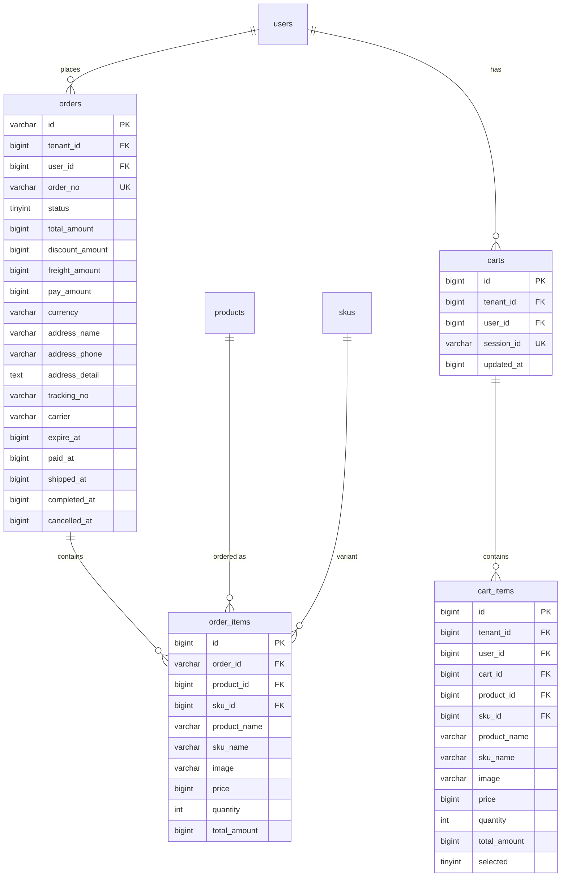
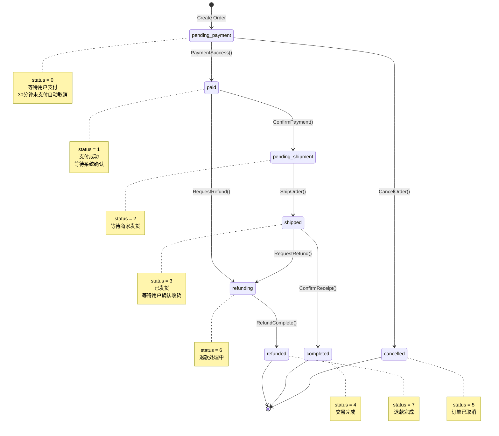
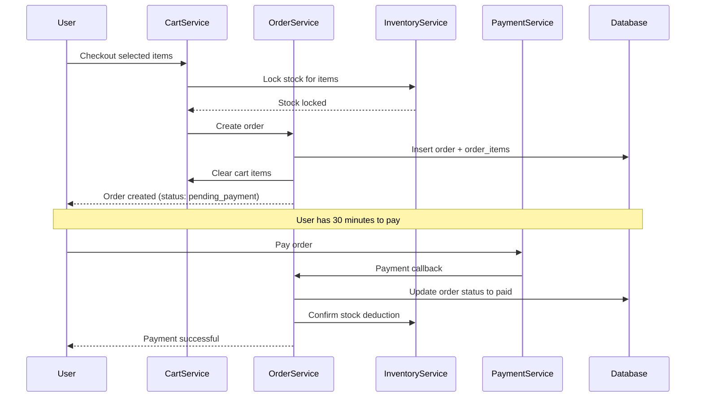

# Order Domain Schema

> Database schema and entity documentation for the Order domain

**Last Updated:** 2026-03-26

## Overview

The Order domain manages the complete order lifecycle, including orders, order items, shopping carts, and cart items.

## Entity Relationship Diagram



---

## Tables

### orders

订单表，存储订单主信息。

| Column | Type | Nullable | Default | Description |
|--------|------|----------|---------|-------------|
| `id` | VARCHAR(64) | NO | - | 订单ID (UUID) |
| `tenant_id` | BIGINT | NO | - | 租户ID |
| `user_id` | BIGINT | NO | - | 用户ID |
| `order_no` | VARCHAR(64) | NO | - | 订单号（唯一） |
| `status` | TINYINT | NO | 0 | 状态: 0-待支付, 1-已支付, 2-待发货, 3-已发货, 4-已完成, 5-已取消, 6-退款中, 7-已退款 |
| `total_amount` | BIGINT | NO | 0 | 商品总额（分） |
| `discount_amount` | BIGINT | NO | 0 | 优惠金额（分） |
| `freight_amount` | BIGINT | NO | 0 | 运费（分） |
| `pay_amount` | BIGINT | NO | 0 | 实付金额（分） |
| `currency` | VARCHAR(10) | YES | 'CNY' | 货币代码 |
| `address_name` | VARCHAR(100) | YES | '' | 收货人姓名 |
| `address_phone` | VARCHAR(20) | YES | '' | 收货人电话 |
| `address_province` | VARCHAR(50) | YES | '' | 省份 |
| `address_city` | VARCHAR(50) | YES | '' | 城市 |
| `address_district` | VARCHAR(50) | YES | '' | 区县 |
| `address_detail` | TEXT | YES | NULL | 详细地址 |
| `address_zipcode` | VARCHAR(20) | YES | '' | 邮编 |
| `tracking_no` | VARCHAR(100) | YES | '' | 快递单号 |
| `carrier` | VARCHAR(50) | YES | '' | 快递公司 |
| `remark` | TEXT | YES | NULL | 订单备注 |
| `expire_at` | BIGINT | NO | 0 | 过期时间戳 |
| `paid_at` | BIGINT | YES | NULL | 支付时间戳 |
| `shipped_at` | BIGINT | YES | NULL | 发货时间戳 |
| `completed_at` | BIGINT | YES | NULL | 完成时间戳 |
| `cancelled_at` | BIGINT | YES | NULL | 取消时间戳 |
| `created_at` | BIGINT | NO | 0 | 创建时间戳 |
| `updated_at` | BIGINT | NO | 0 | 更新时间戳 |
| `created_by` | BIGINT | NO | 0 | 创建人ID |
| `updated_by` | BIGINT | NO | 0 | 更新人ID |

**Indexes:**
- `PRIMARY KEY` (`id`)
- `UNIQUE KEY uk_order_no` (`order_no`)
- `KEY idx_tenant_id` (`tenant_id`)
- `KEY idx_user_id` (`user_id`)
- `KEY idx_status` (`status`)
- `KEY idx_created_at` (`created_at`)

---

### order_items

订单商品表，存储订单中的商品明细。

| Column | Type | Nullable | Default | Description |
|--------|------|----------|---------|-------------|
| `id` | BIGINT | NO | AUTO_INCREMENT | ID |
| `order_id` | VARCHAR(64) | NO | - | 订单ID |
| `product_id` | BIGINT | NO | - | 商品ID |
| `sku_id` | BIGINT | NO | - | SKU ID |
| `product_name` | VARCHAR(255) | NO | - | 商品名称（快照） |
| `sku_name` | VARCHAR(255) | YES | '' | SKU名称（快照） |
| `image` | VARCHAR(500) | YES | '' | 商品图片（快照） |
| `price` | BIGINT | NO | 0 | 单价（分，快照） |
| `quantity` | INT | NO | 1 | 购买数量 |
| `total_amount` | BIGINT | NO | 0 | 小计（分） |
| `created_at` | BIGINT | NO | 0 | 创建时间戳 |

**Indexes:**
- `PRIMARY KEY` (`id`)
- `KEY idx_order_id` (`order_id`)
- `KEY idx_product_id` (`product_id`)
- `KEY idx_sku_id` (`sku_id`)

---

### carts

购物车表，存储用户购物车。

| Column | Type | Nullable | Default | Description |
|--------|------|----------|---------|-------------|
| `id` | BIGINT | NO | AUTO_INCREMENT | 购物车ID |
| `tenant_id` | BIGINT | NO | - | 租户ID |
| `user_id` | BIGINT | YES | NULL | 用户ID（登录用户） |
| `session_id` | VARCHAR(255) | YES | '' | 会话ID（未登录用户） |
| `updated_at` | BIGINT | NO | 0 | 更新时间戳 |

**Indexes:**
- `PRIMARY KEY` (`id`)
- `UNIQUE KEY uk_tenant_user` (`tenant_id`, `user_id`)
- `UNIQUE KEY uk_tenant_session` (`tenant_id`, `session_id`)
- `KEY idx_user_id` (`user_id`)

---

### cart_items

购物车商品表，存储购物车中的商品明细。

| Column | Type | Nullable | Default | Description |
|--------|------|----------|---------|-------------|
| `id` | BIGINT | NO | AUTO_INCREMENT | ID |
| `tenant_id` | BIGINT | NO | - | 租户ID |
| `user_id` | BIGINT | NO | - | 用户ID |
| `cart_id` | BIGINT | NO | - | 购物车ID |
| `product_id` | BIGINT | NO | - | 商品ID |
| `sku_id` | BIGINT | NO | - | SKU ID |
| `product_name` | VARCHAR(255) | NO | - | 商品名称 |
| `sku_name` | VARCHAR(255) | YES | '' | SKU名称 |
| `image` | VARCHAR(500) | YES | '' | 商品图片 |
| `price` | BIGINT | NO | 0 | 单价（分） |
| `quantity` | INT | NO | 1 | 数量 |
| `total_amount` | BIGINT | NO | 0 | 小计（分） |
| `selected` | TINYINT | NO | 1 | 是否选中: 0-否, 1-是 |
| `created_at` | BIGINT | NO | 0 | 创建时间戳 |
| `updated_at` | BIGINT | NO | 0 | 更新时间戳 |
| `created_by` | BIGINT | NO | 0 | 创建人ID |
| `updated_by` | BIGINT | NO | 0 | 更新人ID |

**Indexes:**
- `PRIMARY KEY` (`id`)
- `KEY idx_tenant_id` (`tenant_id`)
- `KEY idx_user_id` (`user_id`)
- `KEY idx_cart_id` (`cart_id`)
- `KEY idx_product_id` (`product_id`)
- `KEY idx_sku_id` (`sku_id`)

---

## Order Status State Machine



---

## Domain Entities

### Order Entity

```go
// shop/internal/domain/order/entity.go

type Order struct {
    ID              string
    TenantID        int64
    UserID          int64
    OrderNo         string
    Status          OrderStatus
    TotalAmount     Money
    DiscountAmount  Money
    FreightAmount   Money
    PayAmount       Money
    ShippingAddress ShippingAddress
    TrackingInfo    TrackingInfo
    Items           []*OrderItem
    Remark          string
    ExpireAt        time.Time
    PaidAt          *time.Time
    ShippedAt       *time.Time
    CompletedAt     *time.Time
    CancelledAt     *time.Time
    CreatedAt       time.Time
    UpdatedAt       time.Time
}

// Business Methods
func (o *Order) CanCancel() bool
func (o *Order) Cancel() error
func (o *Order) MarkAsPaid(paymentID string) error
func (o *Order) Ship(trackingNo, carrier string) error
func (o *Order) Complete() error
func (o *Order) RequestRefund() error
func (o *Order) CalculateTotal() Money
func (o *Order) IsExpired() bool
```

### OrderItem Entity

```go
// shop/internal/domain/order/entity.go

type OrderItem struct {
    ID           int64
    OrderID      string
    ProductID    int64
    SKUID        int64
    ProductName  string  // Snapshot
    SKUName      string  // Snapshot
    Image        string  // Snapshot
    Price        Money   // Snapshot
    Quantity     int
    TotalAmount  Money
}

func (i *OrderItem) CalculateTotal() Money
```

### Cart Entity

```go
// shop/internal/domain/cart/entity.go

type Cart struct {
    ID        int64
    TenantID  int64
    UserID    int64
    SessionID string
    Items     []*CartItem
    UpdatedAt time.Time
}

// Business Methods
func (c *Cart) AddItem(item *CartItem) error
func (c *Cart) RemoveItem(skuID int64) error
func (c *Cart) UpdateQuantity(skuID int64, quantity int) error
func (c *Cart) ToggleSelection(skuID int64, selected bool) error
func (c *Cart) Clear() error
func (c *Cart) GetSelectedItems() []*CartItem
func (c *Cart) CalculateTotal() Money
func (c *Cart) Merge(other *Cart) error  // Guest cart -> User cart
```

---

## Order Status Constants

| Status | Value | Description | Allowed Transitions |
|--------|-------|-------------|---------------------|
| `PendingPayment` | 0 | 待支付 | → paid, cancelled |
| `Paid` | 1 | 已支付 | → pending_shipment, refunding |
| `PendingShipment` | 2 | 待发货 | → shipped |
| `Shipped` | 3 | 已发货 | → completed, refunding |
| `Completed` | 4 | 已完成 | Terminal |
| `Cancelled` | 5 | 已取消 | Terminal |
| `Refunding` | 6 | 退款中 | → refunded |
| `Refunded` | 7 | 已退款 | Terminal |

---

## API Endpoints

| Method | Endpoint | Description |
|--------|----------|-------------|
| POST | `/api/v1/orders` | Create order from cart |
| GET | `/api/v1/orders` | List user orders |
| GET | `/api/v1/orders/{id}` | Get order details |
| POST | `/api/v1/orders/{id}/cancel` | Cancel order |
| POST | `/api/v1/orders/{id}/confirm` | Confirm receipt |
| POST | `/api/v1/orders/{id}/refund` | Request refund |
| GET | `/api/v1/carts` | Get user cart |
| POST | `/api/v1/carts/items` | Add item to cart |
| PUT | `/api/v1/carts/items/{id}` | Update cart item |
| DELETE | `/api/v1/carts/items/{id}` | Remove cart item |
| POST | `/api/v1/carts/merge` | Merge guest cart |

---

## Order Creation Flow



---

## Migration History

| File | Date | Description |
|------|------|-------------|
| `2026031501_create_orders.sql` | 2026-03-15 | Create orders table |
| `2026031502_create_order_items.sql` | 2026-03-15 | Create order_items table |
| `2026031503_create_carts.sql` | 2026-03-15 | Create carts table |
| `2026031504_create_cart_items.sql` | 2026-03-15 | Create cart_items table |

---

## Related Documentation

- [Order PRD](./2026-03-24-order-prd.md)
- [Payment Schema](../payment/2026-03-24-payment-schema.md)
- [Fulfillment Schema](../fulfillment/2026-03-22-fulfillment-schema.md)
- [API Reference](../cross-cutting/api/2026-03-22-api-reference.md)