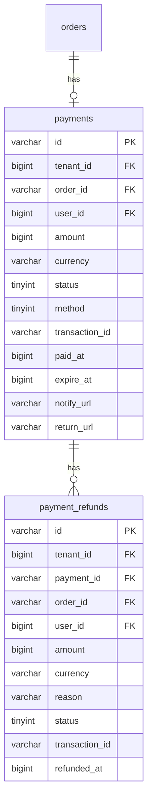
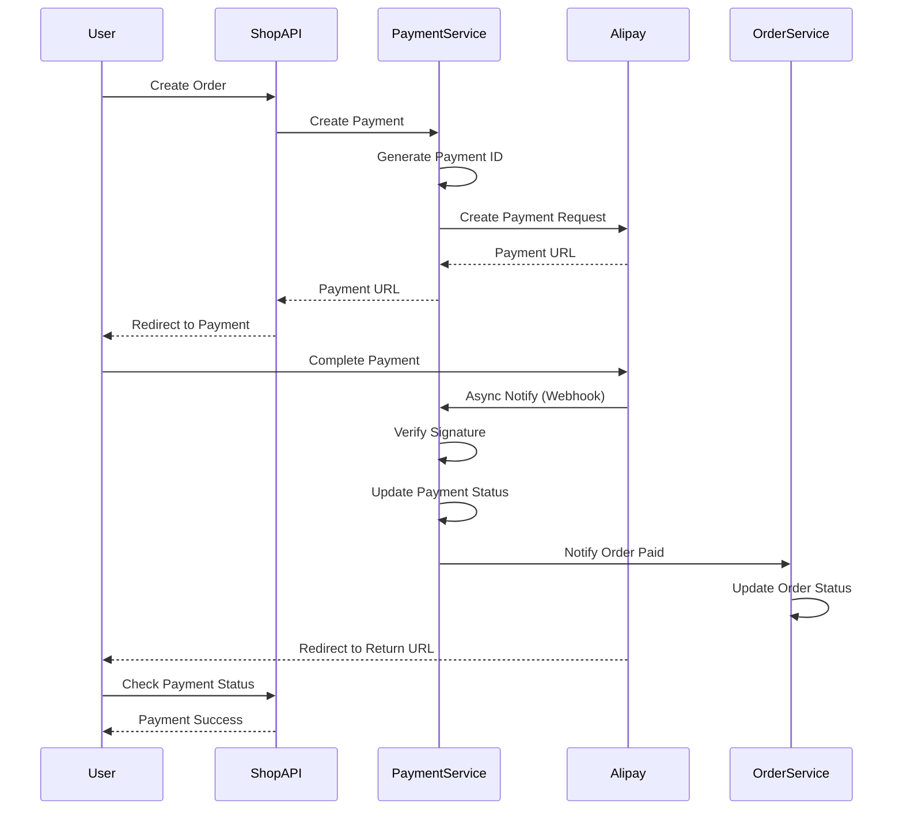

# Payment Domain Schema

> Database schema and entity documentation for the Payment domain

**Last Updated:** 2026-03-26

## Overview

The Payment domain manages payment processing, refunds, and payment method configurations for the e-commerce platform.

## Entity Relationship Diagram



---

## Tables

### payments

支付表，记录所有支付信息。

| Column | Type | Nullable | Default | Description |
|--------|------|----------|---------|-------------|
| `id` | VARCHAR(64) | NO | - | 支付ID (UUID) |
| `tenant_id` | BIGINT | NO | - | 租户ID |
| `order_id` | VARCHAR(64) | NO | - | 订单ID |
| `user_id` | BIGINT | NO | - | 用户ID |
| `amount` | BIGINT | NO | 0 | 支付金额（分） |
| `currency` | VARCHAR(10) | YES | 'CNY' | 货币代码 |
| `status` | TINYINT | NO | 0 | 状态: 0-待支付, 1-处理中, 2-成功, 3-失败, 4-取消, 5-已退款 |
| `method` | TINYINT | NO | 0 | 支付方式: 0-支付宝, 1-微信, 2-信用卡, 3-银行转账, 4-货到付款 |
| `transaction_id` | VARCHAR(255) | YES | '' | 第三方交易号 |
| `paid_at` | BIGINT | YES | NULL | 支付时间戳 |
| `expire_at` | BIGINT | NO | 0 | 过期时间戳 |
| `notify_url` | VARCHAR(500) | YES | '' | 回调URL |
| `return_url` | VARCHAR(500) | YES | '' | 返回URL |
| `created_at` | BIGINT | NO | 0 | 创建时间戳 |
| `updated_at` | BIGINT | NO | 0 | 更新时间戳 |
| `created_by` | BIGINT | NO | 0 | 创建人ID |
| `updated_by` | BIGINT | NO | 0 | 更新人ID |

**Indexes:**
- `PRIMARY KEY` (`id`)
- `KEY idx_tenant_id` (`tenant_id`)
- `KEY idx_order_id` (`order_id`)
- `KEY idx_user_id` (`user_id`)
- `KEY idx_transaction_id` (`transaction_id`)
- `KEY idx_status` (`status`)

---

### payment_refunds

支付退款表，记录退款信息。

| Column | Type | Nullable | Default | Description |
|--------|------|----------|---------|-------------|
| `id` | VARCHAR(64) | NO | - | 退款ID (UUID) |
| `tenant_id` | BIGINT | NO | - | 租户ID |
| `payment_id` | VARCHAR(64) | NO | - | 支付ID |
| `order_id` | VARCHAR(64) | NO | - | 订单ID |
| `user_id` | BIGINT | NO | - | 用户ID |
| `amount` | BIGINT | NO | 0 | 退款金额（分） |
| `currency` | VARCHAR(10) | YES | 'CNY' | 货币代码 |
| `reason` | VARCHAR(500) | YES | '' | 退款原因 |
| `status` | TINYINT | NO | 0 | 状态: 0-待处理, 1-处理中, 2-完成, 3-失败 |
| `transaction_id` | VARCHAR(255) | YES | '' | 第三方交易号 |
| `refunded_at` | BIGINT | YES | NULL | 退款时间戳 |
| `created_at` | BIGINT | NO | 0 | 创建时间戳 |
| `updated_at` | BIGINT | NO | 0 | 更新时间戳 |
| `created_by` | BIGINT | NO | 0 | 创建人ID |
| `updated_by` | BIGINT | NO | 0 | 更新人ID |

**Indexes:**
- `PRIMARY KEY` (`id`)
- `KEY idx_tenant_id` (`tenant_id`)
- `KEY idx_payment_id` (`payment_id`)
- `KEY idx_order_id` (`order_id`)
- `KEY idx_user_id` (`user_id`)
- `KEY idx_status` (`status`)

---

## Payment Status

| Status | Value | Description | Allowed Transitions |
|--------|-------|-------------|---------------------|
| `Pending` | 0 | 待支付 | → processing, cancelled |
| `Processing` | 1 | 处理中 | → success, failed |
| `Success` | 2 | 成功 | → refunded |
| `Failed` | 3 | 失败 | Terminal |
| `Cancelled` | 4 | 已取消 | Terminal |
| `Refunded` | 5 | 已退款 | Terminal |

---

## Payment Methods

| Method | Value | Description |
|--------|-------|-------------|
| `Alipay` | 0 | 支付宝 |
| `WeChat` | 1 | 微信支付 |
| `CreditCard` | 2 | 信用卡 |
| `BankTransfer` | 3 | 银行转账 |
| `CashOnDelivery` | 4 | 货到付款 |

---

## Domain Entities

### Payment Entity

```go
// shop/internal/domain/payment/entity.go

type Payment struct {
    ID            string
    TenantID      int64
    OrderID       string
    UserID        int64
    Amount        Money
    Status        PaymentStatus
    Method        PaymentMethod
    TransactionID string
    PaidAt        *time.Time
    ExpireAt      time.Time
    NotifyURL     string
    ReturnURL     string
    CreatedAt     time.Time
    UpdatedAt     time.Time
}

// Business Methods
func (p *Payment) IsPaid() bool
func (p *Payment) MarkAsSuccess(transactionID string) error
func (p *Payment) MarkAsFailed() error
func (p *Payment) Cancel() error
func (p *Payment) CreateRefund(amount Money, reason string) (*PaymentRefund, error)
func (p *Payment) CanRefund() bool
```

### PaymentRefund Entity

```go
// shop/internal/domain/payment/entity.go

type PaymentRefund struct {
    ID            string
    TenantID      int64
    PaymentID     string
    OrderID       string
    UserID        int64
    Amount        Money
    Reason        string
    Status        RefundStatus
    TransactionID string
    RefundedAt    *time.Time
    CreatedAt     time.Time
    UpdatedAt     time.Time
}

// Business Methods
func (r *PaymentRefund) IsCompleted() bool
func (r *PaymentRefund) MarkAsCompleted(transactionID string) error
func (r *PaymentRefund) MarkAsFailed() error
```

---

## Payment Flow



---

## API Endpoints

| Method | Endpoint | Description |
|--------|----------|-------------|
| POST | `/api/v1/payments` | Create payment |
| GET | `/api/v1/payments/{id}` | Get payment details |
| GET | `/api/v1/payments/order/{order_id}` | Get payment by order |
| POST | `/api/v1/payments/{id}/cancel` | Cancel payment |
| POST | `/api/v1/payments/callback/alipay` | Alipay callback |
| POST | `/api/v1/payments/callback/wechat` | WeChat callback |
| POST | `/api/v1/refunds` | Create refund |
| GET | `/api/v1/refunds/{id}` | Get refund details |
| GET | `/api/v1/refunds/payment/{payment_id}` | Get refunds by payment |

---

## Migration History

| File | Date | Description |
|------|------|-------------|
| `2026031501_create_payments.sql` | 2026-03-15 | Create payments table |
| `2026031502_create_payment_refunds.sql` | 2026-03-15 | Create payment_refunds table |
| `2026032001_alter_payments_add_notify_urls.sql` | 2026-03-20 | Add notify_url and return_url |
| `2026032201_create_payment_transactions.sql` | 2026-03-22 | Create payment_transactions table |
| `2026032401_create_webhook_events.sql` | 2026-03-24 | Create webhook_events table |

---

## Related Documentation

- [Payment PRD](./2026-03-24-payment-prd.md)
- [Order Schema](../order/2026-03-26-order-schema.md)
- [Fulfillment Schema](../fulfillment/2026-03-22-fulfillment-schema.md)
- [API Reference](../cross-cutting/api/2026-03-22-api-reference.md)