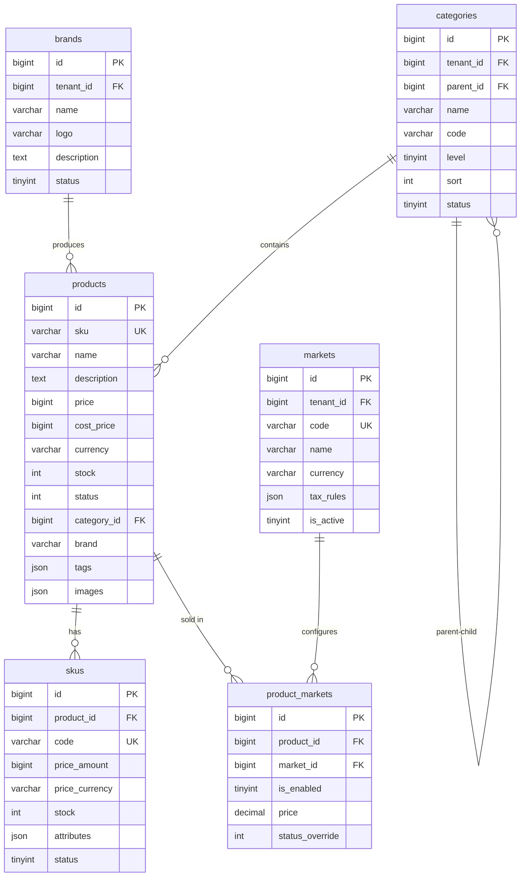
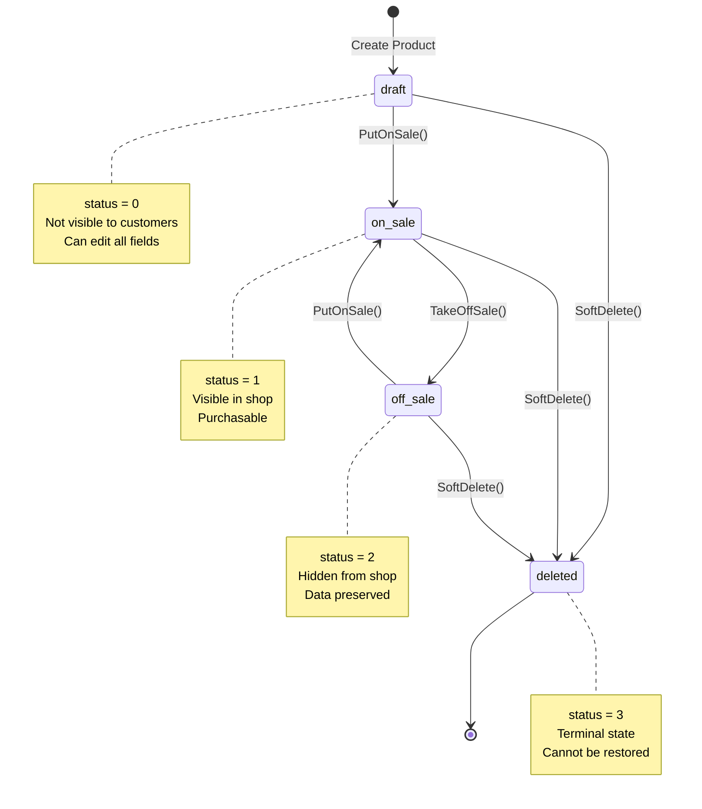

# Product Domain Schema

> Database schema and entity documentation for the Product domain

**Last Updated:** 2026-03-26

## Overview

The Product domain manages the product catalog, including products, SKUs, categories, brands, and multi-market configurations.

## Entity Relationship Diagram



---

## Tables

### categories

分类表，支持多级分类层级结构。

| Column | Type | Nullable | Default | Description |
|--------|------|----------|---------|-------------|
| `id` | BIGINT | NO | AUTO_INCREMENT | 分类ID |
| `tenant_id` | BIGINT | NO | - | 租户ID |
| `parent_id` | BIGINT | NO | 0 | 父分类ID，0表示顶级分类 |
| `name` | VARCHAR(100) | NO | - | 分类名称 |
| `code` | VARCHAR(100) | YES | '' | 分类代码 |
| `level` | TINYINT | NO | 1 | 层级 (1-3) |
| `sort` | INT | NO | 0 | 排序权重 |
| `icon` | VARCHAR(255) | YES | '' | 图标URL |
| `image` | VARCHAR(500) | YES | '' | 图片URL |
| `status` | TINYINT | NO | 1 | 状态: 0-禁用, 1-启用 |
| `created_at` | BIGINT | NO | 0 | 创建时间戳 |
| `updated_at` | BIGINT | NO | 0 | 更新时间戳 |
| `created_by` | BIGINT | NO | 0 | 创建人ID |
| `updated_by` | BIGINT | NO | 0 | 更新人ID |

**Indexes:**
- `PRIMARY KEY` (`id`)
- `KEY idx_tenant_id` (`tenant_id`)
- `KEY idx_parent_id` (`parent_id`)
- `KEY idx_status` (`status`)

---

### brands

品牌表，管理商品品牌信息。

| Column | Type | Nullable | Default | Description |
|--------|------|----------|---------|-------------|
| `id` | BIGINT | NO | AUTO_INCREMENT | 品牌ID |
| `tenant_id` | BIGINT | NO | - | 租户ID |
| `name` | VARCHAR(100) | NO | - | 品牌名称 |
| `logo` | VARCHAR(500) | YES | '' | Logo URL |
| `description` | TEXT | YES | NULL | 品牌描述 |
| `website` | VARCHAR(255) | YES | '' | 官网地址 |
| `sort` | INT | NO | 0 | 排序权重 |
| `status` | TINYINT | NO | 1 | 状态: 0-禁用, 1-启用 |
| `created_at` | BIGINT | NO | 0 | 创建时间戳 |
| `updated_at` | BIGINT | NO | 0 | 更新时间戳 |
| `created_by` | BIGINT | NO | 0 | 创建人ID |
| `updated_by` | BIGINT | NO | 0 | 更新人ID |

**Indexes:**
- `PRIMARY KEY` (`id`)
- `KEY idx_tenant_id` (`tenant_id`)
- `KEY idx_name` (`name`)
- `KEY idx_status` (`status`)

---

### products

商品表，存储商品SPU信息。

| Column | Type | Nullable | Default | Description |
|--------|------|----------|---------|-------------|
| `id` | BIGINT | NO | AUTO_INCREMENT | 商品ID |
| `sku` | VARCHAR(64) | YES | '' | 默认SKU代码 |
| `name` | VARCHAR(200) | NO | - | 商品名称 |
| `description` | TEXT | YES | NULL | 商品描述 |
| `price` | BIGINT | NO | 0 | 售价（分） |
| `cost_price` | BIGINT | NO | 0 | 成本价（分） |
| `currency` | VARCHAR(10) | NO | 'CNY' | 货币代码 |
| `stock` | INT | NO | 0 | 总库存 |
| `status` | INT | NO | 0 | 状态: 0-草稿, 1-上架, 2-下架, 3-已删除 |
| `category_id` | BIGINT | NO | 0 | 分类ID |
| `brand` | VARCHAR(64) | YES | '' | 品牌名称 |
| `tags` | JSON | YES | NULL | 标签数组 |
| `images` | JSON | YES | NULL | 图片URL数组 |
| `is_matrix_product` | TINYINT | NO | 0 | 是否有SKU变体 |
| `hs_code` | VARCHAR(20) | YES | '' | HS编码（海关） |
| `coo` | VARCHAR(10) | YES | '' | 原产国代码 |
| `weight` | DECIMAL(10,2) | YES | 0.00 | 重量 |
| `weight_unit` | VARCHAR(10) | YES | 'g' | 重量单位 |
| `length` | DECIMAL(10,2) | YES | 0.00 | 长度(cm) |
| `width` | DECIMAL(10,2) | YES | 0.00 | 宽度(cm) |
| `height` | DECIMAL(10,2) | YES | 0.00 | 高度(cm) |
| `dangerous_goods` | JSON | YES | NULL | 危险品标识数组 |
| `created_at` | BIGINT | NO | 0 | 创建时间戳 |
| `updated_at` | BIGINT | NO | 0 | 更新时间戳 |

**Indexes:**
- `PRIMARY KEY` (`id`)
- `UNIQUE KEY uk_sku` (`sku`)
- `KEY idx_name` (`name`)
- `KEY idx_category_id` (`category_id`)
- `KEY idx_status` (`status`)

---

### skus

SKU表，存储商品变体信息。

| Column | Type | Nullable | Default | Description |
|--------|------|----------|---------|-------------|
| `id` | BIGINT | NO | AUTO_INCREMENT | SKU ID |
| `product_id` | BIGINT | NO | - | 商品ID |
| `code` | VARCHAR(100) | NO | - | SKU代码（唯一） |
| `price_amount` | BIGINT | NO | 0 | 价格（分） |
| `price_currency` | VARCHAR(10) | YES | 'CNY' | 货币代码 |
| `stock` | INT | NO | 0 | 库存数量 |
| `attributes` | JSON | YES | NULL | 属性键值对 `{"颜色": "黑色", "尺码": "42"}` |
| `status` | TINYINT | NO | 1 | 状态: 0-禁用, 1-启用 |
| `created_at` | BIGINT | NO | 0 | 创建时间戳 |
| `updated_at` | BIGINT | NO | 0 | 更新时间戳 |
| `created_by` | BIGINT | NO | 0 | 创建人ID |
| `updated_by` | BIGINT | NO | 0 | 更新人ID |

**Indexes:**
- `PRIMARY KEY` (`id`)
- `UNIQUE KEY uk_code` (`code`)
- `KEY idx_product_id` (`product_id`)
- `KEY idx_status` (`status`)

---

### markets

市场表，跨境电商市场配置。

| Column | Type | Nullable | Default | Description |
|--------|------|----------|---------|-------------|
| `id` | BIGINT | NO | AUTO_INCREMENT | 市场ID |
| `tenant_id` | BIGINT | NO | 0 | 租户ID |
| `code` | VARCHAR(10) | NO | - | 市场代码: CN, US, UK, DE, FR, AU |
| `name` | VARCHAR(100) | NO | - | 市场名称 |
| `currency` | VARCHAR(10) | NO | - | 货币: CNY, USD, GBP, EUR, AUD |
| `default_language` | VARCHAR(10) | YES | 'en' | 默认语言 |
| `flag` | VARCHAR(255) | YES | '' | 旗帜图标 |
| `is_active` | TINYINT | NO | 1 | 是否启用 |
| `is_default` | TINYINT | NO | 0 | 是否主市场 |
| `tax_rules` | JSON | YES | NULL | 税务配置 |
| `created_at` | DATETIME | NO | CURRENT_TIMESTAMP | 创建时间 |
| `updated_at` | DATETIME | NO | CURRENT_TIMESTAMP | 更新时间 |
| `deleted_at` | DATETIME | YES | NULL | 删除时间（软删除） |

**Indexes:**
- `PRIMARY KEY` (`id`)
- `UNIQUE KEY uk_tenant_code` (`tenant_id`, `code`)
- `KEY idx_code` (`code`)
- `KEY idx_is_active` (`is_active`)
- `KEY idx_deleted_at` (`deleted_at`)

---

### product_markets

商品市场关联表，配置商品在不同市场的定价和状态。

| Column | Type | Nullable | Default | Description |
|--------|------|----------|---------|-------------|
| `id` | BIGINT | NO | AUTO_INCREMENT | ID |
| `tenant_id` | BIGINT | NO | 0 | 租户ID |
| `product_id` | BIGINT | NO | - | 商品ID |
| `variant_id` | BIGINT | YES | NULL | 变体ID（SKU ID） |
| `market_id` | BIGINT | NO | - | 市场ID |
| `is_enabled` | TINYINT | NO | 0 | 是否在该市场启用 |
| `status_override` | INT | YES | NULL | 状态覆盖 |
| `price` | DECIMAL(10,2) | YES | 0.00 | 市场专属价格 |
| `compare_at_price` | DECIMAL(10,2) | YES | NULL | 对比价格（原价） |
| `stock_alert_threshold` | INT | NO | 0 | 库存预警阈值 |
| `published_at` | BIGINT | YES | NULL | 发布时间戳 |
| `created_at` | BIGINT | NO | 0 | 创建时间戳 |
| `updated_at` | BIGINT | NO | 0 | 更新时间戳 |

**Indexes:**
- `PRIMARY KEY` (`id`)
- `KEY idx_tenant_id` (`tenant_id`)
- `KEY idx_product_id` (`product_id`)
- `KEY idx_market_id` (`market_id`)
- `KEY idx_variant_id` (`variant_id`)

---

## Product Status State Machine



---

## Domain Entities

### Product Entity

```go
// admin/internal/domain/product/entity.go

type Product struct {
    ID              int64
    SKU             string
    Name            string
    Description     string
    Price           Money          // Value Object
    CostPrice       Money
    Stock           int
    Status          Status         // Enum: Draft, OnSale, OffSale, Deleted
    CategoryID      int64
    Brand           string
    Tags            []string
    Images          []string
    IsMatrixProduct bool
    Dimensions      Dimensions     // Value Object
    CustomsInfo     CustomsInfo    // Value Object
    DangerousGoods  []string
    CreatedAt       time.Time
    UpdatedAt       time.Time
}

// Business Methods
func (p *Product) PutOnSale() error
func (p *Product) TakeOffSale() error
func (p *Product) SoftDelete() error
func (p *Product) UpdateStock(quantity int) error
func (p *Product) IsAvailable() bool
```

### SKU Entity

```go
// admin/internal/domain/product/entity.go

type SKU struct {
    ID            int64
    ProductID     int64
    Code          string
    Price         Money
    Stock         int
    Attributes    map[string]string
    Status        SKUStatus
    CreatedAt     time.Time
    UpdatedAt     time.Time
}

// Business Methods
func (s *SKU) LockStock(quantity int) error
func (s *SKU) UnlockStock(quantity int) error
func (s *SKU) DeductLockedStock(quantity int) error
func (s *SKU) IsLowStock(safetyStock int) bool
```

### Money Value Object

```go
// pkg/domain/shared/value_objects.go

type Money struct {
    Amount   int64  // Amount in cents (分)
    Currency string // ISO 4217: CNY, USD, EUR, GBP, AUD
}

func (m Money) Add(other Money) (Money, error)
func (m Money) Subtract(other Money) (Money, error)
func (m Money) Multiply(factor int64) Money
func (m Money) Equals(other Money) bool
func (m Money) GreaterThan(other Money) bool
```

---

## API Endpoints

| Method | Endpoint | Description |
|--------|----------|-------------|
| GET | `/api/v1/products` | List products with pagination and filters |
| POST | `/api/v1/products` | Create a new product |
| GET | `/api/v1/products/{id}` | Get product details |
| PUT | `/api/v1/products/{id}` | Update product |
| POST | `/api/v1/products/{id}/on-sale` | Put product on sale |
| POST | `/api/v1/products/{id}/off-sale` | Take product off sale |
| PUT | `/api/v1/products/{id}/stock` | Update product stock |
| GET | `/api/v1/products/{product_id}/skus` | List SKUs for a product |
| POST | `/api/v1/skus` | Create SKU |
| GET | `/api/v1/skus/{id}` | Get SKU details |
| PUT | `/api/v1/skus/{id}` | Update SKU |
| DELETE | `/api/v1/skus/{id}` | Delete SKU |
| GET | `/api/v1/categories` | List categories |
| GET | `/api/v1/categories/tree` | Get category tree |
| POST | `/api/v1/categories` | Create category |
| GET | `/api/v1/categories/{id}` | Get category details |
| PUT | `/api/v1/categories/{id}` | Update category |
| DELETE | `/api/v1/categories/{id}` | Delete category |
| GET | `/api/v1/brands` | List brands |
| POST | `/api/v1/brands` | Create brand |
| GET | `/api/v1/brands/{id}` | Get brand details |
| PUT | `/api/v1/brands/{id}` | Update brand |
| DELETE | `/api/v1/brands/{id}` | Delete brand |
| GET | `/api/v1/markets` | List markets |
| POST | `/api/v1/markets` | Create market |
| GET | `/api/v1/markets/{id}` | Get market details |
| PUT | `/api/v1/markets/{id}` | Update market |
| DELETE | `/api/v1/markets/{id}` | Delete market |

---

## Migration History

| File | Date | Description |
|------|------|-------------|
| `2026031501_create_categories.sql` | 2026-03-15 | Create categories table |
| `2026031502_create_brands.sql` | 2026-03-15 | Create brands table |
| `2026031503_create_products.sql` | 2026-03-15 | Create products table |
| `2026031504_create_skus.sql` | 2026-03-15 | Create skus table |
| `2026031505_create_markets.sql` | 2026-03-15 | Create markets table |
| `2026032001_alter_products_add_dimensions.sql` | 2026-03-20 | Add dimension fields to products |
| `2026032201_create_product_markets.sql` | 2026-03-22 | Create product_markets table |

---

## Related Documentation

- [Product PRD](./2026-03-24-product-prd.md) (待创建)
- [API Reference](../cross-cutting/api/2026-03-22-api-reference.md)
- [Inventory Schema](../points/2026-03-24-points-schema.md)
- [Architecture Diagrams](../reference/2026-03-22-architecture-diagrams.md)