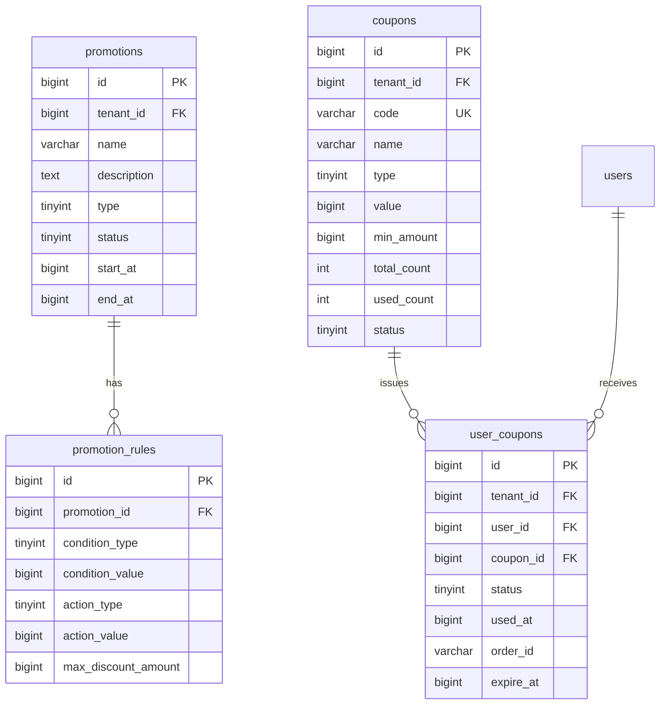

# Promotion Domain Schema

> Database schema and entity documentation for the Promotion domain

**Last Updated:** 2026-03-26

## Overview

The Promotion domain manages promotional activities and coupons, supporting various discount types and rule-based promotions.

## Entity Relationship Diagram



---

## Tables

### promotions

促销活动表，管理各种促销活动。

| Column | Type | Nullable | Default | Description |
|--------|------|----------|---------|-------------|
| `id` | BIGINT | NO | AUTO_INCREMENT | 促销ID |
| `tenant_id` | BIGINT | NO | - | 租户ID |
| `name` | VARCHAR(255) | NO | - | 促销名称 |
| `description` | TEXT | YES | NULL | 描述 |
| `type` | TINYINT | NO | 0 | 类型: 0-折扣, 1-限时抢购, 2-捆绑销售, 3-买X送Y |
| `status` | TINYINT | NO | 0 | 状态: 0-待生效, 1-生效中, 2-已暂停, 3-已结束 |
| `start_at` | BIGINT | NO | 0 | 开始时间戳 |
| `end_at` | BIGINT | NO | 0 | 结束时间戳 |
| `created_at` | BIGINT | NO | 0 | 创建时间戳 |
| `updated_at` | BIGINT | NO | 0 | 更新时间戳 |
| `created_by` | BIGINT | NO | 0 | 创建人ID |
| `updated_by` | BIGINT | NO | 0 | 更新人ID |

**Indexes:**
- `PRIMARY KEY` (`id`)
- `KEY idx_tenant_id` (`tenant_id`)
- `KEY idx_status` (`status`)
- `KEY idx_type` (`type`)
- `KEY idx_start_end` (`start_at`, `end_at`)

---

### promotion_rules

促销规则表，定义促销活动的具体规则。

| Column | Type | Nullable | Default | Description |
|--------|------|----------|---------|-------------|
| `id` | BIGINT | NO | AUTO_INCREMENT | 规则ID |
| `promotion_id` | BIGINT | NO | - | 促销ID |
| `condition_type` | TINYINT | NO | 0 | 条件类型: 0-最低金额, 1-最低数量 |
| `condition_value` | BIGINT | NO | 0 | 条件值（分或件数） |
| `action_type` | TINYINT | NO | 0 | 动作类型: 0-固定金额, 1-百分比 |
| `action_value` | BIGINT | NO | 0 | 动作值（分或百分比） |
| `max_discount_amount` | BIGINT | NO | 0 | 最大优惠金额（分） |
| `max_discount_currency` | VARCHAR(10) | YES | 'CNY' | 货币 |

**Indexes:**
- `PRIMARY KEY` (`id`)
- `KEY idx_promotion_id` (`promotion_id`)

---

### coupons

优惠券表，管理优惠券模板。

| Column | Type | Nullable | Default | Description |
|--------|------|----------|---------|-------------|
| `id` | BIGINT | NO | AUTO_INCREMENT | 优惠券ID |
| `tenant_id` | BIGINT | NO | - | 租户ID |
| `name` | VARCHAR(255) | NO | - | 名称 |
| `code` | VARCHAR(100) | NO | - | 优惠券代码（唯一） |
| `description` | TEXT | YES | NULL | 描述 |
| `type` | TINYINT | NO | 0 | 类型: 0-固定金额, 1-百分比, 2-免邮 |
| `value` | BIGINT | NO | 0 | 优惠值（分或百分比） |
| `min_amount` | BIGINT | NO | 0 | 最低消费（分） |
| `max_discount` | BIGINT | NO | 0 | 最大优惠（分） |
| `total_count` | INT | NO | 0 | 发放总数 |
| `used_count` | INT | NO | 0 | 已使用数量 |
| `per_user_limit` | INT | NO | 1 | 每用户限领 |
| `status` | TINYINT | NO | 0 | 状态: 0-未激活, 1-激活, 2-过期, 3-用完 |
| `start_at` | BIGINT | NO | 0 | 开始时间戳 |
| `end_at` | BIGINT | NO | 0 | 结束时间戳 |
| `created_at` | BIGINT | NO | 0 | 创建时间戳 |
| `updated_at` | BIGINT | NO | 0 | 更新时间戳 |
| `created_by` | BIGINT | NO | 0 | 创建人ID |
| `updated_by` | BIGINT | NO | 0 | 更新人ID |

**Indexes:**
- `PRIMARY KEY` (`id`)
- `UNIQUE KEY uk_code` (`code`)
- `KEY idx_tenant_id` (`tenant_id`)
- `KEY idx_status` (`status`)
- `KEY idx_start_end` (`start_at`, `end_at`)

---

### user_coupons

用户优惠券表，记录用户领取的优惠券。

| Column | Type | Nullable | Default | Description |
|--------|------|----------|---------|-------------|
| `id` | BIGINT | NO | AUTO_INCREMENT | ID |
| `tenant_id` | BIGINT | NO | - | 租户ID |
| `user_id` | BIGINT | NO | - | 用户ID |
| `coupon_id` | BIGINT | NO | - | 优惠券ID |
| `status` | TINYINT | NO | 0 | 状态: 0-未使用, 1-已使用, 2-已过期 |
| `used_at` | BIGINT | YES | NULL | 使用时间戳 |
| `order_id` | VARCHAR(64) | YES | '' | 使用的订单ID |
| `received_at` | BIGINT | NO | 0 | 领取时间戳 |
| `expire_at` | BIGINT | NO | 0 | 过期时间戳 |

**Indexes:**
- `PRIMARY KEY` (`id`)
- `KEY idx_tenant_id` (`tenant_id`)
- `KEY idx_user_id` (`user_id`)
- `KEY idx_coupon_id` (`coupon_id`)
- `KEY idx_status` (`status`)
- `KEY idx_expire_at` (`expire_at`)

---

## Promotion Types

| Type | Value | Description | Example |
|------|-------|-------------|---------|
| `Discount` | 0 | 折扣促销 | 满100减10%，满200减20% |
| `FlashSale` | 1 | 限时抢购 | 限量商品特价销售 |
| `Bundle` | 2 | 捆绑销售 | A+B组合购买优惠 |
| `BuyXGetY` | 3 | 买X送Y | 买2件送1件 |

---

## Promotion Status

| Status | Value | Description |
|--------|-------|-------------|
| `Pending` | 0 | 待生效 |
| `Active` | 1 | 生效中 |
| `Paused` | 2 | 已暂停 |
| `Ended` | 3 | 已结束 |

---

## Coupon Types

| Type | Value | Description | Value Meaning |
|------|-------|-------------|---------------|
| `FixedAmount` | 0 | 固定金额 | 优惠金额（分） |
| `Percentage` | 1 | 百分比折扣 | 折扣百分比 |
| `FreeShipping` | 2 | 免邮 | 无需值 |

---

## Domain Entities

### Promotion Entity

```go
// admin/internal/domain/promotion/entity.go

type Promotion struct {
    ID          int64
    TenantID    int64
    Name        string
    Description string
    Type        PromotionType
    Status      PromotionStatus
    StartTime   time.Time
    EndTime     time.Time
    Rules       []*PromotionRule
    CreatedAt   time.Time
    UpdatedAt   time.Time
}

// Business Methods
func (p *Promotion) Activate() error
func (p *Promotion) Deactivate() error
func (p *Promotion) IsExpired() bool
func (p *Promotion) CalculateDiscount(orderAmount Money) Money
```

### Coupon Entity

```go
// admin/internal/domain/coupon/entity.go

type Coupon struct {
    ID           int64
    TenantID     int64
    Code         string
    Name         string
    Description  string
    Type         CouponType
    Value        int64
    MinAmount    Money
    MaxDiscount  Money
    TotalCount   int
    UsedCount    int
    PerUserLimit int
    Status       CouponStatus
    StartTime    time.Time
    EndTime      time.Time
    CreatedAt    time.Time
    UpdatedAt    time.Time
}

// Business Methods
func (c *Coupon) IsValid() bool
func (c *Coupon) CanIssue() bool
func (c *Coupon) IssueToUser(userID int64) (*UserCoupon, error)
func (c *Coupon) CalculateDiscount(orderAmount Money) Money
```

---

## API Endpoints

### Promotions

| Method | Endpoint | Description |
|--------|----------|-------------|
| GET | `/api/v1/promotions` | List promotions |
| POST | `/api/v1/promotions` | Create promotion |
| GET | `/api/v1/promotions/{id}` | Get promotion details |
| PUT | `/api/v1/promotions/{id}` | Update promotion |
| DELETE | `/api/v1/promotions/{id}` | Delete promotion |
| POST | `/api/v1/promotions/{id}/activate` | Activate promotion |
| POST | `/api/v1/promotions/{id}/deactivate` | Deactivate promotion |
| GET | `/api/v1/promotions/{id}/rules` | Get promotion rules |
| POST | `/api/v1/promotions/{id}/rules` | Add promotion rules |

### Coupons

| Method | Endpoint | Description |
|--------|----------|-------------|
| GET | `/api/v1/coupons` | List coupons |
| POST | `/api/v1/coupons` | Create coupon |
| GET | `/api/v1/coupons/{id}` | Get coupon details |
| PUT | `/api/v1/coupons/{id}` | Update coupon |
| DELETE | `/api/v1/coupons/{id}` | Delete coupon |
| POST | `/api/v1/coupons/generate` | Generate coupon codes |
| GET | `/api/v1/coupons/{id}/usage` | Get coupon usage history |

### User Coupons

| Method | Endpoint | Description |
|--------|----------|-------------|
| POST | `/api/v1/user-coupons` | Issue coupon to user |
| GET | `/api/v1/user-coupons` | List user coupons |

---

## Migration History

| File | Date | Description |
|------|------|-------------|
| `2026031501_create_promotions.sql` | 2026-03-15 | Create promotions table |
| `2026031502_create_promotion_rules.sql` | 2026-03-15 | Create promotion_rules table |
| `2026031503_create_coupons.sql` | 2026-03-15 | Create coupons table |
| `2026031504_create_user_coupons.sql` | 2026-03-15 | Create user_coupons table |
| `2026032201_alter_promotions_add_scope.sql` | 2026-03-22 | Add scope fields to promotions |

---

## Related Documentation

- [Promotion PRD](./2026-03-22-promotion-prd.md)
- [Order Schema](../order/2026-03-26-order-schema.md)
- [API Reference](../cross-cutting/api/2026-03-22-api-reference.md)