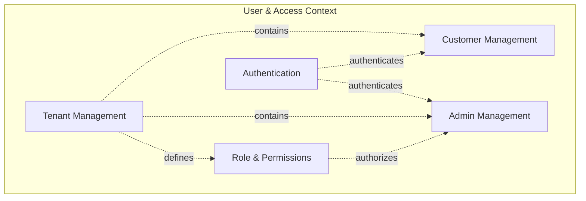
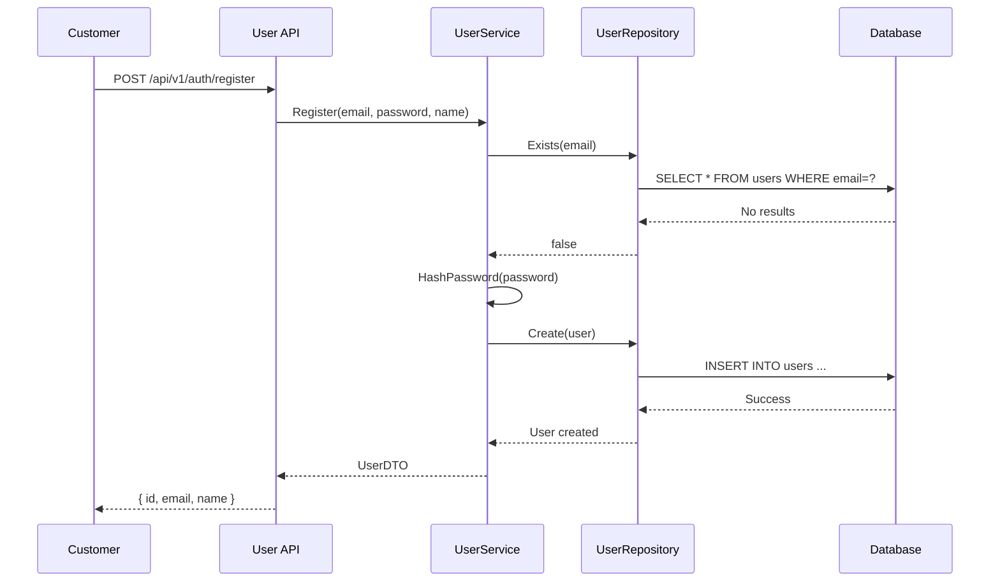
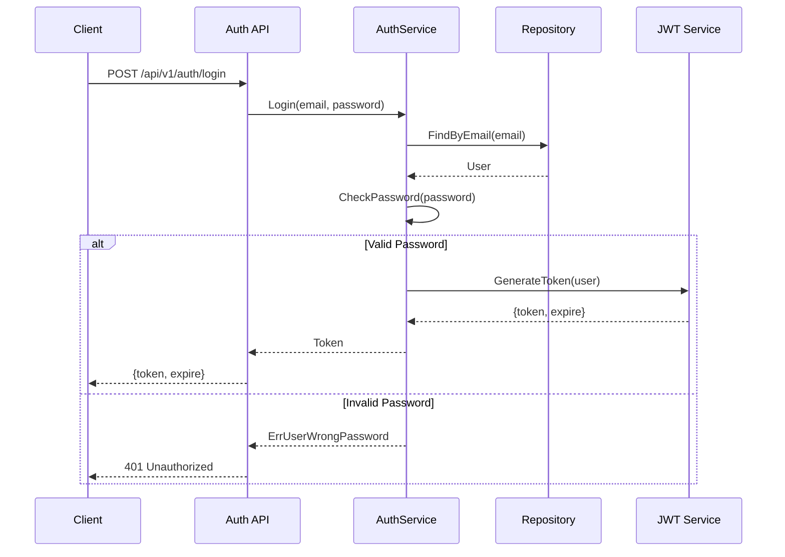
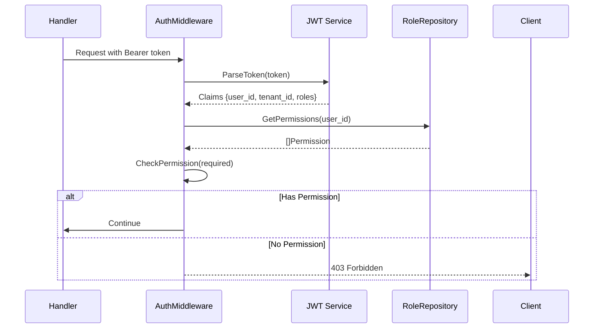

# User Domain Documentation

> **Domain:** User & Access Management
> **Last Updated:** 2026-03-26
> **Status:** Active

---

## Overview

The User domain manages identity and access control for the ShopJoy platform. It encompasses three types of users:

1. **Customers** (`users` table) - End consumers who shop on the platform
2. **Administrators** (`admin_users` table) - Staff managing the store backend
3. **Platform Super Admins** - System-level administrators (tenant_id = 0)

This domain also includes RBAC (Role-Based Access Control) with roles and permissions.

---

## Bounded Context



---

## Entities

### Tenant

The root entity for multi-tenancy. All other entities belong to a tenant.

**Location:** `admin/internal/domain/tenant/entity.go`

**Key Attributes:**

| Field | Type | Description |
|-------|------|-------------|
| `ID` | int64 | Tenant identifier |
| `Name` | string | Display name |
| `Code` | string | Unique code (e.g., "demo") |
| `Status` | int | 0=pending, 1=active, 2=suspended, 3=expired |
| `Plan` | int | 0=free, 1=basic, 2=pro, 3=enterprise |
| `Domain` | string | System-assigned domain |
| `CustomDomain` | string | Custom domain (optional) |
| `ExpireAt` | *UnixTime | Subscription expiration |

**Business Rules:**
- Code must be unique across all tenants
- Suspended or expired tenants cannot access the system
- Each tenant has exactly one shop configuration

### User (Customer)

Represents end customers who make purchases.

**Location:** `admin/internal/domain/user/entity.go`

**Key Attributes:**

| Field | Type | Description |
|-------|------|-------------|
| `ID` | int64 | User identifier |
| `TenantID` | TenantID | Belongs to tenant |
| `Email` | string | Unique email address |
| `Phone` | string | Phone number |
| `Password` | string | BCrypt hashed password |
| `Name` | string | Display name |
| `Avatar` | string | Avatar URL |
| `Gender` | Gender | 0=unknown, 1=male, 2=female, 3=other |
| `Birthday` | *UnixTime | Date of birth |
| `Status` | Status | 0=inactive, 1=active, 2=suspended, 3=deleted |
| `LastLogin` | *UnixTime | Last login timestamp |

**Business Rules:**
- Email must be unique within tenant
- Password must be at least 6 characters
- Suspended users cannot login
- Soft delete preserves order history

**Methods:**

```go
func (u *User) SetPassword(plainPassword string) error
func (u *User) CheckPassword(plainPassword string) bool
func (u *User) CanLogin() bool
func (u *User) Suspend() error
func (u *User) Activate() error
func (u *User) SoftDelete() error
```

### AdminUser

Backend administrators with different permission levels.

**Location:** `admin/internal/domain/adminuser/entity.go`

**Key Attributes:**

| Field | Type | Description |
|-------|------|-------------|
| `ID` | int64 | Admin identifier |
| `TenantID` | int64 | 0=platform super admin |
| `Username` | string | Username |
| `Email` | string | Email address |
| `Mobile` | string | Phone number |
| `Password` | string | BCrypt hash |
| `Type` | int | 1=super, 2=tenant_admin, 3=sub_account |
| `Status` | int | 1=active, 2=disabled, 3=deleted |

**Admin Types:**

| Type | TenantID | Permissions |
|------|----------|-------------|
| Super Admin | 0 | Platform-wide, all tenants |
| Tenant Admin | tenant_id | Full access to own tenant |
| Sub Account | tenant_id | Limited by assigned roles |

### Role

RBAC role definition.

**Location:** `admin/internal/domain/role/entity.go`

**Key Attributes:**

| Field | Type | Description |
|-------|------|-------------|
| `ID` | int64 | Role identifier |
| `TenantID` | TenantID | Belongs to tenant |
| `Name` | string | Display name |
| `Code` | string | Unique code |
| `Description` | string | Description |
| `IsSystem` | bool | System roles cannot be deleted |
| `Status` | int | 0=disabled, 1=enabled |

**System Roles:**
- `admin` - Full access
- `operator` - Product and order management
- `customer_service` - Order and customer support

### UserAddress

Customer shipping addresses.

**Location:** `admin/internal/domain/user/address_entity.go`

**Key Attributes:**

| Field | Type | Description |
|-------|------|-------------|
| `ID` | int64 | Address ID |
| `UserID` | int64 | Belongs to user |
| `Name` | string | Recipient name |
| `Phone` | string | Contact phone |
| `Country` | string | Country code |
| `Province` | string | Province/state |
| `City` | string | City |
| `District` | string | District/county |
| `Address` | string | Street address |
| `PostalCode` | string | ZIP code |
| `IsDefault` | bool | Default shipping address |

---

## Database Schema

### Tables

| Table | Purpose | Records |
|-------|---------|---------|
| `tenants` | Tenant master data | ~100 |
| `users` | Customer accounts | 10K+ per tenant |
| `admin_users` | Admin accounts | ~10 per tenant |
| `roles` | Role definitions | ~5 per tenant |
| `permissions` | System permissions | ~50 (shared) |
| `user_roles` | User-role assignments | Many-to-many |
| `role_permissions` | Role-permission mappings | Many-to-many |
| `user_addresses` | Shipping addresses | 3-5 per user |

### Key Relationships

```sql
-- Tenant owns all data
-- All tables have: tenant_id BIGINT NOT NULL

-- Users belong to tenants
users.tenant_id -> tenants.id

-- Admin users belong to tenants (or platform)
admin_users.tenant_id -> tenants.id (or 0 for platform)

-- Roles defined per tenant
roles.tenant_id -> tenants.id

-- User roles mapping
user_roles.user_id -> admin_users.id
user_roles.role_id -> roles.id

-- Role permissions mapping
role_permissions.role_id -> roles.id
role_permissions.permission_id -> permissions.id

-- User addresses
user_addresses.user_id -> users.id
```

---

## API Endpoints

### Authentication

| Method | Endpoint | Description | Auth |
|--------|----------|-------------|------|
| POST | `/api/v1/auth/login` | Login (returns JWT) | No |
| POST | `/api/v1/auth/register` | Register new account | No |
| POST | `/api/v1/auth/logout` | Logout | Yes |
| POST | `/api/v1/auth/refresh` | Refresh token | Yes |

### Users (Admin API)

| Method | Endpoint | Description |
|--------|----------|-------------|
| GET | `/api/v1/users` | List users |
| GET | `/api/v1/users/:id` | Get user detail |
| PUT | `/api/v1/users/:id` | Update user |
| POST | `/api/v1/users/:id/suspend` | Suspend user |
| POST | `/api/v1/users/:id/activate` | Activate user |
| DELETE | `/api/v1/users/:id` | Delete user |
| POST | `/api/v1/users/:id/reset-password` | Reset password |
| GET | `/api/v1/users/stats` | User statistics |
| GET | `/api/v1/users/:id/addresses` | Get user addresses |

### Admin Users

| Method | Endpoint | Description |
|--------|----------|-------------|
| GET | `/api/v1/admin-users` | List admin users |
| POST | `/api/v1/admin-users` | Create admin user |
| GET | `/api/v1/admin-users/:id` | Get admin user |
| PUT | `/api/v1/admin-users/:id` | Update admin user |
| DELETE | `/api/v1/admin-users/:id` | Delete admin user |
| PUT | `/api/v1/admin-users/:id/status` | Update status |

### Roles & Permissions

| Method | Endpoint | Description |
|--------|----------|-------------|
| GET | `/api/v1/roles` | List roles |
| POST | `/api/v1/roles` | Create role |
| GET | `/api/v1/roles/:id` | Get role detail |
| PUT | `/api/v1/roles/:id` | Update role |
| DELETE | `/api/v1/roles/:id` | Delete role |
| GET | `/api/v1/roles/:id/permissions` | Get role permissions |
| PUT | `/api/v1/roles/:id/permissions` | Update permissions |
| GET | `/api/v1/permissions` | List all permissions |

---

## Business Workflows

### Customer Registration Flow



### Login Flow



### RBAC Permission Check



---

## Error Codes

| Code | Message | HTTP Status |
|------|---------|-------------|
| 10001 | invalid email format | 400 |
| 10002 | invalid phone format | 400 |
| 10003 | password too weak | 400 |
| 10004 | admin user not found | 404 |
| 10005 | duplicate admin user | 409 |
| 10006 | wrong password | 401 |
| 10007 | cannot delete yourself | 400 |
| 10008 | user already deleted | 400 |
| 10009 | account disabled or deleted | 403 |
| 10010 | passwords do not match | 400 |
| 10011 | permission denied | 403 |
| 11001 | invalid email format | 400 |
| 11004 | user not found | 404 |
| 11005 | duplicate user | 409 |
| 11006 | wrong password | 401 |
| 11009 | user already suspended | 400 |
| 11012 | address not found | 404 |

---

## Code Examples

### Creating a User

```go
package main

import (
    "context"
    "github.com/colinrs/shopjoy/admin/internal/domain/user"
)

func createUser(ctx context.Context, repo user.Repository, db *gorm.DB) error {
    u := &user.User{
        TenantID: shared.TenantID(1),
        Email:    "customer@example.com",
        Name:     "John Doe",
        Status:   user.StatusActive,
    }

    if err := u.SetPassword("securePassword123"); err != nil {
        return err
    }

    return repo.Create(ctx, db, u)
}
```

### Checking Permissions

```go
func (h *Handler) CreateProduct(w http.ResponseWriter, r *http.Request) {
    // Middleware already checked JWT and set context
    ctx := r.Context()
    userType := ctx.Value("user_type").(int)

    if userType != 2 && userType != 1 { // Not admin or super
        http.Error(w, code.ErrAdminPermissionDenied.Msg, http.StatusForbidden)
        return
    }

    // Continue with handler logic
}
```

---

## Testing

### Unit Test Example

```go
func TestUser_SetPassword(t *testing.T) {
    u := &User{}

    // Valid password
    err := u.SetPassword("secure123")
    assert.NoError(t, err)
    assert.NotEmpty(t, u.Password)

    // Too short
    err = u.SetPassword("123")
    assert.Equal(t, code.ErrUserPasswordTooWeak, err)
}

func TestUser_CheckPassword(t *testing.T) {
    u := &User{}
    u.SetPassword("correct_password")

    assert.True(t, u.CheckPassword("correct_password"))
    assert.False(t, u.CheckPassword("wrong_password"))
}
```

---

## References

- [Schema SQL](../../sql/user/schema.sql)
- [User Entity](../../admin/internal/domain/user/entity.go)
- [Admin User Entity](../../admin/internal/domain/adminuser/entity.go)
- [API Definition](../../admin/desc/user.api)
- [Architecture](../../ARCHITECTURE.md)

---

## Document History

| Version | Date | Author | Changes |
|---------|------|--------|---------|
| 1.0 | 2026-03-26 | Technical Team | Initial domain documentation |
