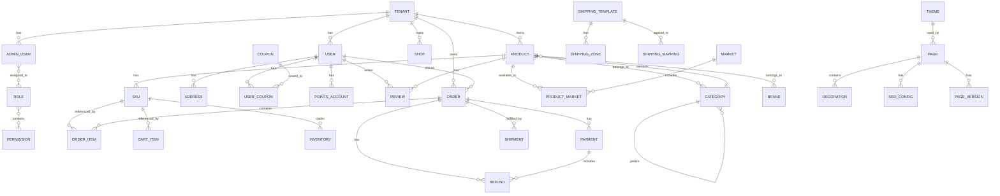

# ShopJoy Database Overview

> **Version:** 1.0
> **Last Updated:** 2026-03-27
> **Database:** MySQL 8.0

---

## Overview

The ShopJoy database follows a multi-tenant design with shared infrastructure and tenant-isolated data. All tables include `tenant_id` for data isolation.

### Database Conventions

| Convention | Standard |
|------------|----------|
| Table Names | lowercase with underscores (e.g., `products`, `order_items`) |
| Primary Keys | `id` BIGINT, auto-increment |
| Tenant ID | `tenant_id` BIGINT, indexed |
| Timestamps | `created_at`, `updated_at` TIMESTAMP |
| Soft Delete | `deleted_at` BIGINT (Unix timestamp) |
| Monetary | `*_amount` BIGINT (cents), `*_currency` VARCHAR(3) |
| Status Fields | TINYINT or INT with descriptive constants |

---

## Domain Schema Mapping

| Domain | Schema File | Key Tables |
|--------|------------|------------|
| User | `sql/user/schema.sql` | users, addresses |
| Admin User | `sql/user/schema.sql` | admin_users, roles, permissions |
| Product | `sql/product/schema.sql` | products, skus, categories, brands |
| Market | `sql/product/schema.sql` | markets, product_markets |
| Inventory | `sql/product/schema.sql` | warehouses, inventory, inventory_logs |
| Order | `sql/order/schema.sql` | orders, order_items |
| Payment | `sql/payment/schema.sql` | payments, transactions, refunds |
| Fulfillment | `sql/fulfillment/schema.sql` | shipments, carriers, refund_reasons |
| Promotion | `sql/promotion/schema.sql` | promotions, promotion_rules, coupons |
| Points | `sql/points/schema.sql` | points_accounts, points_transactions |
| Storefront | `sql/storefront/schema.sql` | themes, pages, decorations, seo_configs |
| Review | `sql/review/schema.sql` | reviews, review_replies |
| Shop | `sql/shop/schema.sql` | shops, shipping_templates, shipping_zones |

---

## Entity Relationship Diagram



---

## Core Tables

### Users (`users`)

| Column | Type | Constraints | Description |
|--------|------|-------------|-------------|
| id | BIGINT | PK, AUTO_INCREMENT | User ID |
| tenant_id | BIGINT | NOT NULL, INDEX | Tenant identifier |
| email | VARCHAR(255) | NOT NULL, UNIQUE | Email address |
| phone | VARCHAR(50) | | Phone number |
| password | VARCHAR(255) | NOT NULL | Hashed password |
| name | VARCHAR(100) | NOT NULL | Display name |
| avatar | VARCHAR(500) | | Avatar URL |
| gender | TINYINT | DEFAULT 0 | Gender (0=unknown, 1=male, 2=female) |
| birthday | BIGINT | | Birthday (Unix timestamp) |
| status | TINYINT | DEFAULT 1 | Status (0=inactive, 1=active, 2=suspended) |
| last_login | BIGINT | | Last login time |
| deleted_at | BIGINT | | Soft delete timestamp |
| created_at | TIMESTAMP | DEFAULT CURRENT_TIMESTAMP | Creation time |
| updated_at | TIMESTAMP | ON UPDATE CURRENT_TIMESTAMP | Last update |

**Indexes:**
- `idx_tenant_id` on (tenant_id)
- `idx_email` on (email)
- `idx_phone` on (phone)

---

### Admin Users (`admin_users`)

| Column | Type | Constraints | Description |
|--------|------|-------------|-------------|
| id | BIGINT | PK, AUTO_INCREMENT | Admin ID |
| tenant_id | BIGINT | NOT NULL | Tenant (0 for platform admins) |
| username | VARCHAR(50) | NOT NULL, UNIQUE | Login username |
| email | VARCHAR(255) | NOT NULL | Email |
| mobile | VARCHAR(50) | | Mobile |
| password | VARCHAR(255) | NOT NULL | Hashed password |
| real_name | VARCHAR(100) | | Real name |
| avatar | VARCHAR(500) | | Avatar URL |
| type | TINYINT | NOT NULL | Type (1=platform, 2=tenant_admin, 3=sub_account) |
| status | TINYINT | DEFAULT 1 | Status (1=normal, 2=disabled) |
| last_login | BIGINT | | Last login |
| created_at | TIMESTAMP | | Creation time |
| updated_at | TIMESTAMP | | Last update |

---

### Roles (`roles`)

| Column | Type | Constraints | Description |
|--------|------|-------------|-------------|
| id | BIGINT | PK | Role ID |
| tenant_id | BIGINT | NOT NULL | Tenant |
| name | VARCHAR(50) | NOT NULL | Role name |
| code | VARCHAR(50) | NOT NULL | Role code |
| description | VARCHAR(255) | | Description |
| status | TINYINT | DEFAULT 1 | Status |
| is_system | BOOL | DEFAULT FALSE | System role flag |
| created_at | TIMESTAMP | | Creation time |
| updated_at | TIMESTAMP | | Last update |

---

### Permissions (`permissions`)

| Column | Type | Constraints | Description |
|--------|------|-------------|-------------|
| id | BIGINT | PK | Permission ID |
| name | VARCHAR(50) | NOT NULL | Permission name |
| code | VARCHAR(100) | NOT NULL | Permission code |
| type | TINYINT | NOT NULL | Type (0=menu, 1=button, 2=api) |
| parent_id | BIGINT | | Parent permission |
| path | VARCHAR(255) | | API path or menu path |
| icon | VARCHAR(50) | | Icon name |
| sort | INT | DEFAULT 0 | Sort order |

---

### Products (`products`)

| Column | Type | Constraints | Description |
|--------|------|-------------|-------------|
| id | BIGINT | PK | Product ID |
| tenant_id | BIGINT | NOT NULL, INDEX | Tenant |
| sku | VARCHAR(50) | | SKU code |
| name | VARCHAR(255) | NOT NULL | Product name |
| description | TEXT | | Description |
| price_amount | BIGINT | NOT NULL | Price in cents |
| price_currency | VARCHAR(3) | NOT NULL DEFAULT 'CNY' | Currency |
| cost_price_amount | BIGINT | | Cost price |
| cost_price_currency | VARCHAR(3) | | Cost currency |
| stock | INT | DEFAULT 0 | Stock quantity |
| status | TINYINT | DEFAULT 0 | Status (0=draft, 1=on_sale, 2=off_sale) |
| category_id | BIGINT | | Category |
| brand | VARCHAR(100) | | Brand name |
| sku_prefix | VARCHAR(20) | | SKU prefix for variants |
| tags | JSON | | Product tags |
| images | JSON | | Product images |
| is_matrix_product | BOOL | DEFAULT FALSE | Has variants |
| hs_code | VARCHAR(20) | | HS code (customs) |
| coo | VARCHAR(3) | | Country of origin |
| weight | DECIMAL(10,3) | | Weight |
| weight_unit | VARCHAR(10) | | Weight unit |
| length | DECIMAL(10,2) | | Length |
| width | DECIMAL(10,2) | | Width |
| height | DECIMAL(10,2) | | Height |
| dangerous_goods | JSON | | Dangerous goods flags |
| deleted_at | BIGINT | | Soft delete |
| created_at | TIMESTAMP | | Creation time |
| updated_at | TIMESTAMP | | Last update |

**Indexes:**
- `idx_tenant_id` on (tenant_id)
- `idx_category_id` on (category_id)
- `idx_status` on (status)
- `idx_sku` on (sku)

---

### SKUs (`skus`)

| Column | Type | Constraints | Description |
|--------|------|-------------|-------------|
| id | BIGINT | PK | SKU ID |
| product_id | BIGINT | NOT NULL, INDEX | Parent product |
| code | VARCHAR(50) | NOT NULL, UNIQUE | SKU code |
| price_amount | BIGINT | NOT NULL | Price |
| price_currency | VARCHAR(3) | NOT NULL | Currency |
| stock | INT | DEFAULT 0 | Stock |
| locked_stock | INT | DEFAULT 0 | Locked for orders |
| safety_stock | INT | DEFAULT 0 | Minimum stock alert |
| pre_sale_enabled | BOOL | DEFAULT FALSE | Pre-sale enabled |
| attributes | JSON | | Size, color, etc. |
| status | TINYINT | DEFAULT 1 | Status |
| created_at | TIMESTAMP | | Creation |
| updated_at | TIMESTAMP | | Last update |

---

### Categories (`categories`)

| Column | Type | Constraints | Description |
|--------|------|-------------|-------------|
| id | BIGINT | PK | Category ID |
| parent_id | BIGINT | DEFAULT 0 | Parent category |
| tenant_id | BIGINT | NOT NULL | Tenant |
| name | VARCHAR(100) | NOT NULL | Category name |
| code | VARCHAR(50) | | Category code |
| level | TINYINT | DEFAULT 1 | Tree level (max 3) |
| sort | INT | DEFAULT 0 | Sort order |
| icon | VARCHAR(255) | | Icon URL |
| image | VARCHAR(255) | | Image URL |
| seo_title | VARCHAR(255) | | SEO title |
| seo_description | TEXT | | SEO description |
| status | TINYINT | DEFAULT 1 | Status |
| created_at | TIMESTAMP | | Creation |
| updated_at | TIMESTAMP | | Last update |

**Indexes:**
- `idx_parent_id` on (parent_id)
- `idx_tenant_id` on (tenant_id)

---

### Markets (`markets`)

| Column | Type | Constraints | Description |
|--------|------|-------------|-------------|
| id | BIGINT | PK | Market ID |
| code | VARCHAR(10) | NOT NULL, UNIQUE | Market code (US, UK, DE) |
| name | VARCHAR(100) | NOT NULL | Market name |
| currency | VARCHAR(3) | NOT NULL | Default currency |
| default_language | VARCHAR(10) | | Default language |
| flag | VARCHAR(10) | | Country flag emoji |
| is_active | BOOL | DEFAULT TRUE | Active status |
| is_default | BOOL | DEFAULT FALSE | Default market |
| vat_rate | VARCHAR(10) | | VAT rate |
| gst_rate | VARCHAR(10) | | GST rate |
| ioss_enabled | BOOL | | IOSS enabled |
| include_tax | BOOL | | Prices include tax |
| created_at | TIMESTAMP | | Creation |
| updated_at | TIMESTAMP | | Last update |

---

### Product Markets (`product_markets`)

| Column | Type | Constraints | Description |
|--------|------|-------------|-------------|
| id | BIGINT | PK | Record ID |
| product_id | BIGINT | NOT NULL, INDEX | Product |
| market_id | BIGINT | NOT NULL, INDEX | Market |
| is_enabled | BOOL | DEFAULT TRUE | Enabled in market |
| price | DECIMAL(19,4) | | Market-specific price |
| compare_at_price | DECIMAL(19,4) | | Original price |
| currency | VARCHAR(3) | | Currency |
| stock_alert_threshold | INT | | Low stock alert |
| published_at | BIGINT | | Publish time |
| created_at | TIMESTAMP | | Creation |
| updated_at | TIMESTAMP | | Last update |

**Indexes:**
- `idx_product_market` UNIQUE on (product_id, market_id)

---

### Warehouses (`warehouses`)

| Column | Type | Constraints | Description |
|--------|------|-------------|-------------|
| id | BIGINT | PK | Warehouse ID |
| tenant_id | BIGINT | NOT NULL | Tenant |
| code | VARCHAR(20) | NOT NULL, UNIQUE | Warehouse code |
| name | VARCHAR(100) | NOT NULL | Warehouse name |
| country | VARCHAR(10) | | Country |
| address | VARCHAR(255) | | Address |
| is_default | BOOL | DEFAULT FALSE | Default warehouse |
| status | TINYINT | DEFAULT 1 | Status |
| created_at | TIMESTAMP | | Creation |
| updated_at | TIMESTAMP | | Last update |

---

### Inventory (`inventory`)

| Column | Type | Constraints | Description |
|--------|------|-------------|-------------|
| id | BIGINT | PK | Record ID |
| sku_id | BIGINT | NOT NULL, INDEX | SKU |
| warehouse_id | BIGINT | NOT NULL, INDEX | Warehouse |
| available_stock | INT | DEFAULT 0 | Available stock |
| locked_stock | INT | DEFAULT 0 | Locked stock |
| safety_stock | INT | DEFAULT 0 | Minimum safety stock |
| created_at | TIMESTAMP | | Creation |
| updated_at | TIMESTAMP | | Last update |

**Indexes:**
- `idx_sku_warehouse` UNIQUE on (sku_id, warehouse_id)

---

### Orders (`orders`)

| Column | Type | Constraints | Description |
|--------|------|-------------|-------------|
| id | BIGINT | PK | Order ID |
| order_no | VARCHAR(32) | NOT NULL, UNIQUE | Order number |
| tenant_id | BIGINT | NOT NULL, INDEX | Tenant |
| user_id | BIGINT | NOT NULL, INDEX | Customer |
| status | VARCHAR(20) | NOT NULL | Order status |
| total_amount | DECIMAL(19,4) | NOT NULL | Total amount |
| discount_amount | DECIMAL(19,4) | DEFAULT 0 | Discount |
| pay_amount | DECIMAL(19,4) | NOT NULL | Payment amount |
| currency | VARCHAR(3) | NOT NULL | Currency |
| remark | VARCHAR(500) | | Customer remark |
| admin_remark | VARCHAR(500) | | Admin remark |
| fulfillment_status | TINYINT | DEFAULT 0 | Fulfillment status |
| refund_status | TINYINT | DEFAULT 0 | Refund status |
| paid_at | BIGINT | | Payment time |
| shipped_at | BIGINT | | Shipment time |
| delivered_at | BIGINT | | Delivery time |
| cancelled_at | BIGINT | | Cancellation time |
| cancel_reason | VARCHAR(255) | | Cancellation reason |
| created_at | TIMESTAMP | | Creation |
| updated_at | TIMESTAMP | | Last update |

**Indexes:**
- `idx_order_no` UNIQUE on (order_no)
- `idx_tenant_id` on (tenant_id)
- `idx_user_id` on (user_id)
- `idx_status` on (status)
- `idx_created_at` on (created_at)

---

### Order Items (`order_items`)

| Column | Type | Constraints | Description |
|--------|------|-------------|-------------|
| id | BIGINT | PK | Item ID |
| order_id | BIGINT | NOT NULL, INDEX | Order |
| product_id | BIGINT | NOT NULL | Product |
| sku_id | BIGINT | | SKU (if variant) |
| product_name | VARCHAR(255) | NOT NULL | Product name snapshot |
| sku_name | VARCHAR(255) | | SKU name snapshot |
| image | VARCHAR(500) | | Image snapshot |
| unit_price | DECIMAL(19,4) | NOT NULL | Unit price |
| quantity | INT | NOT NULL | Quantity |
| line_total | DECIMAL(19,4) | NOT NULL | Line total |
| shipped_qty | INT | DEFAULT 0 | Shipped quantity |
| refunded_qty | INT | DEFAULT 0 | Refunded quantity |
| created_at | TIMESTAMP | | Creation |

---

### Payments (`payments`)

| Column | Type | Constraints | Description |
|--------|------|-------------|-------------|
| id | BIGINT | PK | Payment ID |
| payment_no | VARCHAR(64) | NOT NULL, UNIQUE | Payment number |
| tenant_id | BIGINT | NOT NULL | Tenant |
| order_id | BIGINT | NOT NULL, INDEX | Order |
| user_id | BIGINT | NOT NULL | User |
| amount | DECIMAL(19,4) | NOT NULL | Amount |
| currency | VARCHAR(3) | NOT NULL | Currency |
| status | TINYINT | NOT NULL | Status |
| channel | VARCHAR(50) | | Payment channel |
| channel_transaction_id | VARCHAR(100) | | Channel TX ID |
| paid_at | BIGINT | | Payment time |
| created_at | TIMESTAMP | | Creation |
| updated_at | TIMESTAMP | | Last update |

**Indexes:**
- `idx_payment_no` UNIQUE on (payment_no)
- `idx_order_id` on (order_id)

---

### Refunds (`refunds`)

| Column | Type | Constraints | Description |
|--------|------|-------------|-------------|
| id | BIGINT | PK | Refund ID |
| refund_no | VARCHAR(64) | NOT NULL, UNIQUE | Refund number |
| payment_id | BIGINT | NOT NULL, INDEX | Payment |
| order_id | BIGINT | NOT NULL | Order |
| user_id | BIGINT | NOT NULL | User |
| type | TINYINT | NOT NULL | Type (1=full, 2=partial) |
| amount | DECIMAL(19,4) | NOT NULL | Refund amount |
| currency | VARCHAR(3) | NOT NULL | Currency |
| status | TINYINT | NOT NULL | Status |
| reason_type | VARCHAR(50) | | Reason type |
| reason | VARCHAR(255) | | Reason description |
| reject_reason | VARCHAR(255) | | Rejection reason |
| approved_at | BIGINT | | Approval time |
| approved_by | BIGINT | | Approver ID |
| completed_at | BIGINT | | Completion time |
| channel_refund_id | VARCHAR(100) | | Channel refund ID |
| created_at | TIMESTAMP | | Creation |
| updated_at | TIMESTAMP | | Last update |

---

### Promotions (`promotions`)

| Column | Type | Constraints | Description |
|--------|------|-------------|-------------|
| id | BIGINT | PK | Promotion ID |
| tenant_id | BIGINT | NOT NULL | Tenant |
| name | VARCHAR(255) | NOT NULL | Name |
| description | TEXT | | Description |
| type | VARCHAR(50) | NOT NULL | Type |
| status | VARCHAR(20) | NOT NULL | Status |
| discount_type | VARCHAR(50) | | Discount type |
| discount_value | DECIMAL(19,4) | | Discount value |
| min_order_amount | DECIMAL(19,4) | | Minimum order |
| max_discount | DECIMAL(19,4) | | Maximum discount |
| usage_limit | INT | | Total usage limit |
| used_count | INT | DEFAULT 0 | Times used |
| per_user_limit | INT | | Per user limit |
| start_time | BIGINT | | Start time |
| end_time | BIGINT | | End time |
| product_ids | JSON | | Applicable products |
| category_ids | JSON | | Applicable categories |
| market_ids | JSON | | Applicable markets |
| tags | JSON | | Promotion tags |
| created_at | TIMESTAMP | | Creation |
| updated_at | TIMESTAMP | | Last update |

---

### Coupons (`coupons`)

| Column | Type | Constraints | Description |
|--------|------|-------------|-------------|
| id | BIGINT | PK | Coupon ID |
| tenant_id | BIGINT | NOT NULL | Tenant |
| code | VARCHAR(50) | NOT NULL, UNIQUE | Coupon code |
| name | VARCHAR(255) | NOT NULL | Name |
| description | TEXT | | Description |
| type | VARCHAR(50) | NOT NULL | Type |
| discount_value | DECIMAL(19,4) | NOT NULL | Discount value |
| min_order_amount | DECIMAL(19,4) | | Minimum order |
| max_discount | DECIMAL(19,4) | | Maximum discount |
| usage_limit | INT | | Total limit |
| per_user_limit | INT | | Per user limit |
| used_count | INT | DEFAULT 0 | Times used |
| start_time | BIGINT | | Start time |
| end_time | BIGINT | | End time |
| status | VARCHAR(20) | | Status |
| product_ids | JSON | | Applicable products |
| category_ids | JSON | | Applicable categories |
| market_ids | JSON | | Applicable markets |
| created_at | TIMESTAMP | | Creation |
| updated_at | TIMESTAMP | | Last update |

---

### User Coupons (`user_coupons`)

| Column | Type | Constraints | Description |
|--------|------|-------------|-------------|
| id | BIGINT | PK | Record ID |
| user_id | BIGINT | NOT NULL, INDEX | User |
| coupon_id | BIGINT | NOT NULL, INDEX | Coupon |
| order_id | BIGINT | | Order used in |
| status | VARCHAR(20) | NOT NULL | Status |
| used_at | BIGINT | | Usage time |
| created_at | TIMESTAMP | | Creation |
| updated_at | TIMESTAMP | | Last update |

**Indexes:**
- `idx_user_coupon` on (user_id, coupon_id)

---

### Shipments (`shipments`)

| Column | Type | Constraints | Description |
|--------|------|-------------|-------------|
| id | BIGINT | PK | Shipment ID |
| shipment_no | VARCHAR(32) | NOT NULL, UNIQUE | Shipment number |
| order_id | BIGINT | NOT NULL, INDEX | Order |
| carrier_code | VARCHAR(50) | | Carrier code |
| carrier_name | VARCHAR(100) | | Carrier name |
| tracking_no | VARCHAR(100) | | Tracking number |
| tracking_url | VARCHAR(500) | | Tracking URL |
| shipping_cost | DECIMAL(19,4) | | Shipping cost |
| currency | VARCHAR(3) | | Currency |
| weight | DECIMAL(10,3) | | Package weight |
| status | TINYINT | DEFAULT 0 | Status |
| shipped_at | BIGINT | | Ship time |
| delivered_at | BIGINT | | Delivery time |
| remark | VARCHAR(500) | | Remark |
| created_by | BIGINT | | Creator ID |
| created_at | TIMESTAMP | | Creation |
| updated_at | TIMESTAMP | | Last update |

---

### Points Accounts (`points_accounts`)

| Column | Type | Constraints | Description |
|--------|------|-------------|-------------|
| id | BIGINT | PK | Account ID |
| user_id | BIGINT | NOT NULL, UNIQUE | User |
| tenant_id | BIGINT | NOT NULL | Tenant |
| balance | BIGINT | DEFAULT 0 | Current balance |
| frozen_balance | BIGINT | DEFAULT 0 | Frozen points |
| total_earned | BIGINT | DEFAULT 0 | Total earned |
| total_redeemed | BIGINT | DEFAULT 0 | Total redeemed |
| total_expired | BIGINT | DEFAULT 0 | Total expired |
| created_at | TIMESTAMP | | Creation |
| updated_at | TIMESTAMP | | Last update |

---

### Points Transactions (`points_transactions`)

| Column | Type | Constraints | Description |
|--------|------|-------------|-------------|
| id | BIGINT | PK | Transaction ID |
| user_id | BIGINT | NOT NULL, INDEX | User |
| account_id | BIGINT | NOT NULL | Account |
| points | BIGINT | NOT NULL | Points (+/-) |
| balance_after | BIGINT | NOT NULL | Balance after |
| type | VARCHAR(20) | NOT NULL | Type |
| reference_type | VARCHAR(50) | | Reference entity type |
| reference_id | VARCHAR(64) | | Reference entity ID |
| description | VARCHAR(255) | | Description |
| expires_at | BIGINT | | Expiration time |
| created_at | TIMESTAMP | | Creation |

---

### Themes (`themes`)

| Column | Type | Constraints | Description |
|--------|------|-------------|-------------|
| id | BIGINT | PK | Theme ID |
| code | VARCHAR(50) | NOT NULL, UNIQUE | Theme code |
| name | VARCHAR(100) | NOT NULL | Name |
| description | TEXT | | Description |
| preview_image | VARCHAR(500) | | Preview URL |
| thumbnail | VARCHAR(500) | | Thumbnail URL |
| is_preset | BOOL | DEFAULT FALSE | Preset theme |
| config_schema | JSON | | Configuration schema |
| created_at | TIMESTAMP | | Creation |
| updated_at | TIMESTAMP | | Last update |

---

### Pages (`pages`)

| Column | Type | Constraints | Description |
|--------|------|-------------|-------------|
| id | BIGINT | PK | Page ID |
| tenant_id | BIGINT | NOT NULL | Tenant |
| theme_id | BIGINT | NOT NULL | Theme |
| page_type | VARCHAR(50) | NOT NULL | Page type |
| name | VARCHAR(100) | NOT NULL | Page name |
| slug | VARCHAR(100) | NOT NULL | URL slug |
| is_published | BOOL | DEFAULT FALSE | Published |
| version | INT | DEFAULT 1 | Version number |
| created_at | TIMESTAMP | | Creation |
| updated_at | TIMESTAMP | | Last update |

---

### Decorations (`decorations`)

| Column | Type | Constraints | Description |
|--------|------|-------------|-------------|
| id | BIGINT | PK | Decoration ID |
| page_id | BIGINT | NOT NULL, INDEX | Page |
| block_type | VARCHAR(50) | NOT NULL | Block type |
| block_config | JSON | | Block configuration |
| sort_order | INT | DEFAULT 0 | Display order |
| created_at | TIMESTAMP | | Creation |
| updated_at | TIMESTAMP | | Last update |

---

### Reviews (`reviews`)

| Column | Type | Constraints | Description |
|--------|------|-------------|-------------|
| id | BIGINT | PK | Review ID |
| tenant_id | BIGINT | NOT NULL | Tenant |
| order_id | BIGINT | NOT NULL | Order |
| product_id | BIGINT | NOT NULL | Product |
| user_id | BIGINT | NOT NULL | User |
| quality_rating | INT | NOT NULL | Quality (1-5) |
| value_rating | INT | | Value rating (1-5) |
| overall_rating | DECIMAL(2,1) | | Overall (calculated) |
| content | TEXT | | Review content |
| images | JSON | | Review images |
| is_anonymous | BOOL | DEFAULT FALSE | Anonymous |
| is_verified | BOOL | DEFAULT FALSE | Verified purchase |
| status | VARCHAR(20) | NOT NULL | Status |
| is_featured | BOOL | DEFAULT FALSE | Featured |
| helpful_count | INT | DEFAULT 0 | Helpful votes |
| created_at | TIMESTAMP | | Creation |
| updated_at | TIMESTAMP | | Last update |

---

## Query Patterns

### Tenant Isolation Query

```sql
-- Always include tenant_id filter
SELECT * FROM products
WHERE id = ? AND tenant_id = ?;
```

### Soft Delete Query

```sql
-- Exclude soft deleted records
SELECT * FROM products
WHERE id = ? AND tenant_id = ? AND deleted_at IS NULL;
```

### Pagination

```sql
-- Efficient pagination with index
SELECT * FROM orders
WHERE tenant_id = ?
ORDER BY created_at DESC
LIMIT 20 OFFSET 40;
```

### Timestamp Handling

```sql
-- All timestamps stored as Unix milliseconds
INSERT INTO products (name, created_at, updated_at)
VALUES ('Product', UNIX_TIMESTAMP(), UNIX_TIMESTAMP());

-- Convert for display
SELECT id, name, FROM_UNIXTIME(created_at/1000) as created_at
FROM products;
```

---

## Document History

| Version | Date | Author | Changes |
|---------|------|--------|---------|
| 1.0 | 2026-03-27 | Technical Team | Initial database overview |
